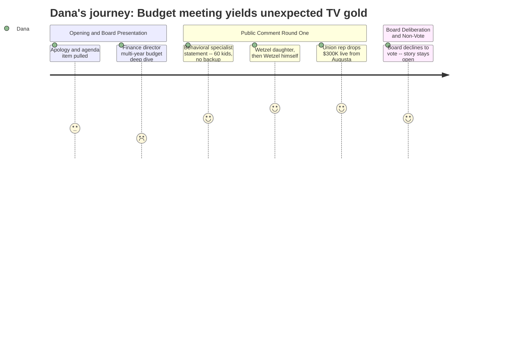

# Interpretation: Dana (PERSONA-009)
## Meeting: School Board Regular Meeting -- April 2, 2026 -- 2026-04-02

### Structured Points

#### 1. Board chair pulls early release days before the meeting even starts
- **Fact:** Board Chair DeAngelis opened by removing agenda item 4.1 — four proposed early release days tied to reconfiguration prep — after parent pushback. The board voted unanimously to remove it, and the superintendent will now pursue a state waiver for a single reduced school day instead.
- **Source:** [02:24--08:39]
- **Emotional valence:** positive
- **Threat level:** 3
- **Open question:** true

#### 2. Board member Rich publicly apologizes to Dr. Prince for prior meeting remarks
- **Fact:** Chair DeAngelis opened by acknowledging that at the previous Monday meeting, board member Rich made a comment about Dr. Prince's performance that violated decorum rules. Rich then apologized directly on the record: "I was out of line."
- **Source:** [01:38--02:24]
- **Emotional valence:** neutral
- **Threat level:** 2
- **Open question:** false

#### 3. Wetzel family speaks back-to-back -- daughter then dad
- **Fact:** Lucy Hutzel, a high school student, spoke at the mic to defend her father Mr. Wetzel, the middle school computer science teacher whose position is proposed for elimination. She described how his class opened her to a possible career path. Wetzel followed her immediately, said he originally came only to yield time, struggled to finish his statement, and told the room he will return to his hallways tomorrow still not knowing what to say to his students. Computer science will not be available next year under the current proposal.
- **Source:** [152:24--156:15]
- **Emotional valence:** negative
- **Threat level:** 5
- **Open question:** false

#### 4. Union rep announces $300K in new state funding -- live, mid-meeting
- **Fact:** SSPA president Connie DeSanto told the board she had just received a text during the meeting from the state house: South Portland is likely to receive an additional $300,000 in state funding -- $150K tied to the homeless student population and $150K tied to economically disadvantaged students -- as a direct result of union staff and teachers lobbying Augusta lawmakers in March. All three employee unions urged the board to use the funds for student-facing positions.
- **Source:** [121:38--123:39]
- **Emotional valence:** positive
- **Threat level:** 5
- **Open question:** true

#### 5. Behavioral specialist position cut -- statement read aloud with specific student numbers
- **Fact:** A statement from Jenna Goldstein Walsh, the district's elementary general education behavioral strategist (position proposed for elimination), was read into the record. It detailed that she directly supported nearly 60 individual students this year, developed over 40 formal behavior plans, and designed individualized social-emotional supports for approximately 50 students. The statement argued that eliminating the role removes "the middle layer" between no support and special education referral, and that the district's 23% special ed rate -- already higher than surrounding districts -- would likely increase.
- **Source:** [101:14--106:07]
- **Emotional valence:** negative
- **Threat level:** 4
- **Open question:** false

#### 6. Parent reads out names and term-end dates of the five board members who voted for reconfiguration
- **Fact:** Parent Brian Green closed his public comment by naming each of the five board members who voted for reconfiguration and stating their seat expiration years: Holman (2026), Dowling (2027), Dean (2027), Rich (2028), Smith (2028). He urged the community to ensure "these are the last years that any of these individuals hold any sort of power." Board member Smith later responded from the dais, calling Green's comments "hurtful and painful" and describing the experience as bullying.
- **Source:** [156:07--159:22] and [230:29--233:03]
- **Emotional valence:** negative
- **Threat level:** 4
- **Open question:** false

#### 7. Board declines to vote on the FY27 budget -- meeting ends without a decision
- **Fact:** After nearly five hours, the board did not take action on agenda item 4.3 (adopting the FY27 superintendent's budget). Multiple board members cited the mid-meeting news of potential new state funding -- including a separate text received by a board member suggesting an additional $750K from EPS formula changes next year -- as reason to wait. The board tentatively discussed convening again on Monday, pending confirmation of the actual funding figures. The superintendent's budget proceeds to the city council April 7th regardless as the default.
- **Source:** [264:20--279:09]
- **Emotional valence:** neutral
- **Threat level:** 4
- **Open question:** true

---

### Journey Map

---

### Reactions

Okay so I sat through all five hours of this and here is your package. Lead with the Wetzel double-feature. His daughter Lucy is a high school kid, she gets up and says without her dad's class she wouldn't know computer science was something she could have a future in. Then he walks up right after her -- he says he only came to maybe yield his time to somebody else -- and he cannot hold it together. He thanks the teachers, thanks the community, says he's going back to those hallways tomorrow and he still won't know what to tell his students. Computer science gone next year under this proposal. That is ninety seconds of television. That is the package. Get me Wetzel on camera before Monday.

The second thing you need for the lede is the live breaking-news moment about a third of the way through public comment. A union rep named Connie DeSanto gets up and says she has been getting texts during the meeting -- during the meeting -- from Augusta, and South Portland is likely getting an extra $300,000 in state funding that her union members went and lobbied for in person. That changed everything. The board spent the rest of the night debating whether to delay the budget vote, and then they did -- they walked out of a five-hour meeting without voting on the budget. A board member got another text saying there might be $750K more coming next year from a formula change. Monday is apparently the real vote. That is your follow. Send a crew Monday.

For the broader season arc, what I'm watching now is the June 9th referendum. Parent after parent got up and said explicitly, on the record: I will vote no on this budget to pressure you to reverse reconfiguration. The board chair had to explain, twice, that defeating the budget does not undo the reconfiguration vote. The community either doesn't believe that or doesn't care -- they want a mechanism to push back and this is the only one they have. A parent also got up and read out the names and election years of the five board members who voted for reconfiguration. Board member Smith responded from the dais and said it felt like bullying. That exchange is your B-story. Two minutes if we can get sound from both of them.