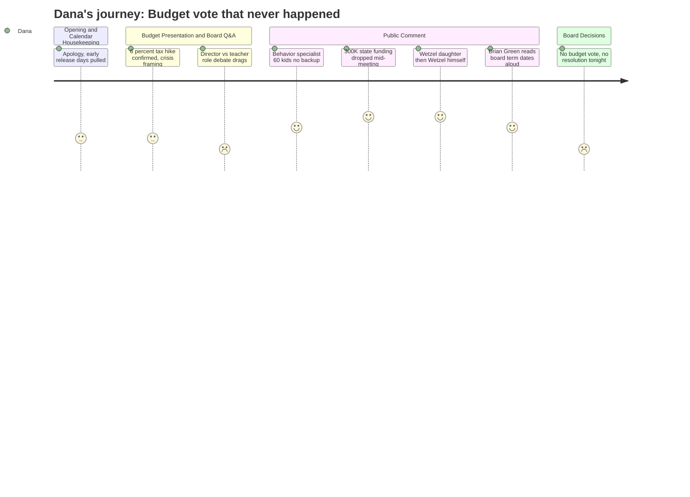

# Interpretation: Dana (PERSONA-009)
## Meeting: School Board Regular Meeting -- April 2, 2026 -- 2026-04-02

### Structured Points

#### 1. Father-Daughter Moment -- Computer Science Teacher and His Kid
- **Fact:** High schooler Lucy Hutzel spoke in defense of her father, Mr. Wetzel, the middle school computer science teacher being cut. Mr. Wetzel then followed her at the mic, visibly emotional, saying he would return to school the next morning to face his students "and still not know what to say."
- **Source:** Transcript, public comment section, approximately [02:52:00]--[02:56:00]
- **Emotional valence:** negative
- **Threat level:** 2
- **Open question:** false

#### 2. Union Rep Announces Surprise $300K in State Funding -- Mid-Meeting
- **Fact:** SSPA president Connie DeSanto announced, while still at the podium during public comment, that she had just received a text during the meeting indicating South Portland would receive approximately $300,000 in additional state funding based on homeless and economically disadvantaged student populations -- money her union had lobbied Augusta for in person.
- **Source:** Transcript, public comment, approximately [02:21:00]--[02:24:00]
- **Emotional valence:** positive
- **Threat level:** 1
- **Open question:** true

#### 3. Board Does Not Vote on the Budget -- Leaves Empty-Handed
- **Fact:** Despite the superintendent recommending the board pass the FY27 budget that evening, the board declined to vote, with multiple members citing the surprise state funding and their discomfort approving a budget with no fund balance. The board tentatively agreed to consider meeting Monday to revisit.
- **Source:** Transcript, approximately [04:15:00]--[04:30:00]; agenda item 4.3
- **Emotional valence:** neutral
- **Threat level:** 3
- **Open question:** true

#### 4. Angry Parent Reads Off Board Members' Term Expiration Dates by Name
- **Fact:** Parent Brian Green named five specific board members who voted for reconfiguration and read their term end dates aloud, urging the community to remember them at the polls. He called the decision "arbitrary and capricious" and said these should be "the last years that any of these individuals hold any sort of power."
- **Source:** Transcript, public comment, approximately [02:37:00]--[02:40:00]
- **Emotional valence:** negative
- **Threat level:** 4
- **Open question:** false

#### 5. Behavior Specialist's Written Statement -- 60 Kids, No One to Replace Her
- **Fact:** A colleague read a written statement from Jenna Goldstein Walsh, the elementary general education behavioral specialist whose position is being eliminated. The statement said she currently supports nearly 60 students across four schools, has written over 40 formal behavior plans this year, and that cutting her role "removes the system we have in place" without eliminating the needs -- potentially pushing more students into special education, which is "significantly more expensive per student."
- **Source:** Transcript, public comment, approximately [01:41:00]--[01:46:00]
- **Emotional valence:** negative
- **Threat level:** 4
- **Open question:** false

#### 6. Bus Driver Warning -- Three Shoulder Surgeries, Drivers Already Quitting
- **Fact:** Bus driver and union representative Jen Lauard testified that among current staff doing lunch table setup and breakdown -- a duty the district is exploring assigning to drivers -- there are already six injuries, three shoulder surgeries, and three workers in physical therapy. She added that drivers are currently looking for other jobs over the proposed duty changes, and the district is already down two bus driver positions.
- **Source:** Transcript, public comment, approximately [01:57:00]--[02:00:00]
- **Emotional valence:** negative
- **Threat level:** 4
- **Open question:** false

#### 7. Board Member Holman Tears Up Responding to Harsh Public Comments
- **Fact:** After Brian Green's pointed public comment naming individual board members, board member Holman spoke during school board communications to say the words were "hurtful and painful," compared the experience to a child being bullied, and said she had "never met Mr. Green." She explicitly asked the public to consider how hurtful words can be.
- **Source:** Transcript, school board communications, approximately [04:31:00]--[04:33:00]
- **Emotional valence:** negative
- **Threat level:** 2
- **Open question:** false

---

### Journey Map

---

### Reactions

OK so this is the segment. Five hours, and I have maybe twelve minutes of usable tape. But the twelve minutes I have are *good*. Lead is easy: a high school girl defends her dad at the mic -- her dad, the teacher being cut -- and then the dad walks up right after her and says he's going back to school tomorrow and still doesn't know what to tell his kids. That's the open. That's thirty seconds of anchor intro right there and I don't even need a script.

The budget headline is 78 positions, six percent tax hike, no vote tonight -- they punted. That's actually useful because it gives me a second bite. The Monday meeting is my next decision: do I send a crew or watch the recording? I'm leaning toward crew because the $300K state funding surprise -- a union rep got a text *during public comment* and announced it from the podium, mid-meeting -- that money could bring some positions back, and if the board votes Monday, that's the resolution beat. I need to find out by tomorrow morning whether that number is confirmed or still a rumor, because one of the board members said her legislator texted a different figure. That's a phone call I need to make before noon.

The counter-narrative is right there and nobody's going to run it except maybe us: a parent stood up and read the five board members' names and their term expiration dates. On camera. That's going to spread. The board chair cried up there at the end and said public shaming is like bullying. That's two angles in one thirty-second exchange, and the tension between them -- angry community, defensive board -- is the whole season arc in miniature. B-roll is Skillin and Kaler, the school they're closing. Walk the sidewalk, show the crossing guard, get a shot of the parking lot empty at drop-off. If I can get Mr. Wetzel to do a brief stand-up outside the building tomorrow I'll take it, but I'm not counting on it.