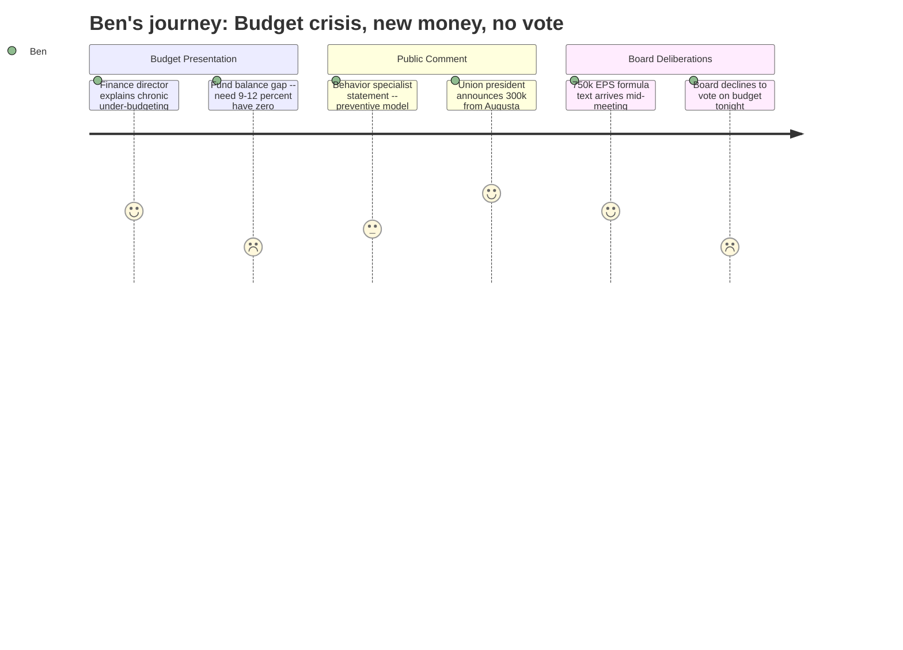

# Interpretation: Ben (PERSONA-010)
## Meeting: School Board Regular Meeting -- April 2, 2026 -- 2026-04-02

### Structured Points

#### 1. The plain-English explanation of how the district got here
- **Fact:** Finance director Abigail Katchen presented a slide showing the district has chronically under-budgeted non-personnel costs for years — electricity overspent by $138K in FY23, $211K in FY24, $165K in FY25, and an estimated $368K+ in FY26. Tuition reimbursement showed the same pattern every year. Her thesis: without a savings buffer, optimistic budgeting in one year produces personnel cuts the next.
- **Source:** Transcript [16:28–20:24]
- **Emotional valence:** positive
- **Threat level:** 2
- **Open question:** false

#### 2. Mid-meeting: $300,000 in new state funding announced from the floor
- **Fact:** SSPA president Connie DeSanto announced during public comment — reading from a text she received during the meeting — that union leaders and staff who lobbied lawmakers in Augusta in March had secured a likely $300,000 in additional state funding: $150K tied to the district's homeless student population and $150K tied to economically disadvantaged students.
- **Source:** Transcript [122:05–123:51]
- **Emotional valence:** positive
- **Threat level:** 1
- **Open question:** true

#### 3. The board did not vote on the budget
- **Fact:** After four months of development and nine prior meetings, the board declined to adopt the FY27 superintendent's budget at this meeting. Multiple members cited the late-arriving state funding figures and the desire to know the precise dollar amount before voting. The board tentatively discussed meeting Monday — the only remaining window before the April 7th council presentation.
- **Source:** Transcript [272:50–279:06]
- **Emotional valence:** negative
- **Threat level:** 3
- **Open question:** true

#### 4. Cutting a director saves almost nothing — and board members said so out loud
- **Fact:** Board members Feller and Holman both expressed frustration that replacing the DEI Director with a DEI Strategist, and eliminating the Assistant Director of Special Education in favor of an Instructional Strategist, produced savings of only $20,000–$30,000 each — because the new roles carry similar compensation. Member Holman said flatly: "I expected to see money liberated in another place, and that's been disappointing."
- **Source:** Transcript [39:50–46:00]
- **Emotional valence:** negative
- **Threat level:** 3
- **Open question:** true

#### 5. Fund balance target: 9–12% of operating costs. Current balance: zero
- **Fact:** Finance director Katchen confirmed the district has no fund balance remaining and disclosed that best practice — following the city's own thresholds — is to maintain 9–12% of annual operating costs in reserves. On a $75.6M budget, the minimum threshold would be roughly $6.8M. Board member Feller used the word "negligent" to describe the years of spending that depleted it.
- **Source:** Transcript [70:08–70:54]
- **Emotional valence:** negative
- **Threat level:** 4
- **Open question:** false

#### 6. A $750,000 EPS formula change arrived by text during deliberations
- **Fact:** During the board's deliberation over whether to vote on the budget, board member Richardson mentioned receiving a text message indicating that changes to the state EPS funding formula could provide an additional $750,000 for FY27. The figure was unconfirmed, and another board member noted it may be a one-year-only allocation — but it shifted the room enough that the board chose not to vote that night.
- **Source:** Transcript [264:13–264:25]
- **Emotional valence:** positive
- **Threat level:** 2
- **Open question:** true

#### 7. The behavior specialist's statement — the human story of what's ending
- **Fact:** A statement from Jenna Goldstein Walsh, the district's elementary general education behavioral specialist whose position is being eliminated, was read into the record. It described working directly with nearly 60 students this year, developing over 40 formal behavior plans, and warned that eliminating the role removes the "middle layer" of support — meaning students either get nothing or are referred to special education, which costs significantly more per student. The district's special education identification rate is already 23%, higher than surrounding districts.
- **Source:** Transcript [101:14–106:07]
- **Emotional valence:** negative
- **Threat level:** 4
- **Open question:** true

---

### Journey Map

---

### Reactions

So I have the piece — or maybe two pieces. The board was supposed to vote tonight on the FY27 budget. They didn't. Here's why: partway through public comment, the union president walks up to the mic and says she just got a text from the statehouse. Teachers and staff had driven to Augusta in March, lobbied lawmakers themselves, and apparently it worked — a likely $300,000 in new state money for homeless and economically disadvantaged students. Then, during board deliberations, a board member holds up her phone and says she got a text saying a state EPS formula change might bring another $750,000. Suddenly there's potentially over a million dollars that didn't exist two hours earlier, the board is recalculating everything on the fly, and nobody votes. The budget goes to the city council on Tuesday anyway — as the superintendent's budget, not the board's — because that's just what happens when the board doesn't act.

The other story I finally got tonight: a plain-English explanation of how the district ran out of money. The finance director had a slide — electricity overspent four years running, tuition reimbursement overspent every year, budgeted for less than they actually spent each time. Her argument was simple: when you have no savings and you budget wishfully, the overage shows up as job cuts the following year. That's the machine that produced 78 eliminated positions. She also disclosed the district should be holding 9–12% of its operating budget in reserve — call it $6–7 million — and currently has zero. Board member Feller used the word "negligent" for the record. That's the sentence I've been trying to get out of someone all season.

The human material tonight was harder to ignore than any prior meeting. A statement was read on behalf of the elementary behavior specialist whose position is being cut — 60 kids she works with individually, 40-plus formal behavior plans she designed and oversees. Her question to the board: when she's gone, who designs those plans? The board didn't have a clean answer. And the middle school computer science teacher — his daughter came and spoke for him, then he came up himself and said tomorrow he goes back to his students still not knowing what to tell them. I want to talk to both of them before Friday. The story isn't really about the budget vote that didn't happen. It's about who's going to absorb the work of people who won't be there next year, and whether anyone has actually answered that question.