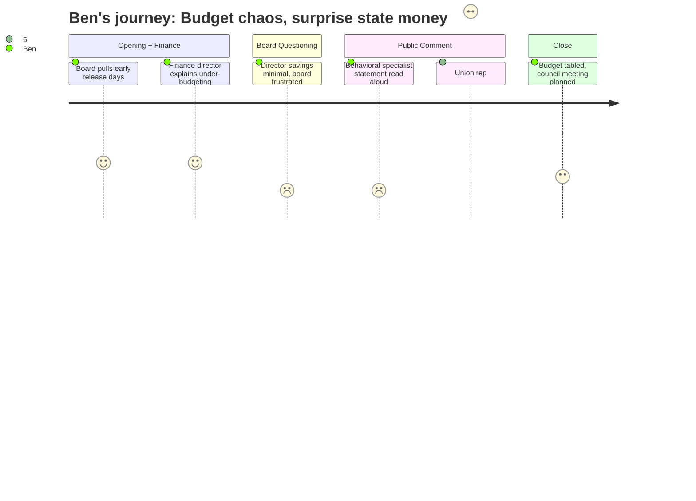

# Interpretation: Ben (PERSONA-010)
## Meeting: School Board Regular Meeting -- April 2, 2026 -- 2026-04-02

### Structured Points

#### 1. Five hours, no budget vote
- **Fact:** After nearly five hours of discussion, the board voted unanimously to convene a budget guidance meeting with city council but took no action on adopting the FY27 budget itself. The vote was deferred, with a possible Monday session contingent on getting confirmed figures from the state.
- **Source:** [273:38--279:06]
- **Emotional valence:** neutral
- **Threat level:** 2
- **Open question:** true

#### 2. $1 million in surprise state funding announced mid-meeting
- **Fact:** SSPA president Connie DeSanto announced during public comment that union lobbying in Augusta had yielded approximately $300,000 in new state funding — $150,000 tied to homeless student population, $150,000 to economically disadvantaged students. Within the same hour, Board Member Richardson relayed a text from Representative Kessler indicating a potential additional $750,000 from EPS formula changes, though she cautioned the figure was unconfirmed and described by the legislator as a one-year change.
- **Source:** [122:05--123:39] (DeSanto); [264:08--264:20] (Richardson/Kessler text)
- **Emotional valence:** positive
- **Threat level:** 1
- **Open question:** true

#### 3. Finance director gives the clearest "how we got here" of the season
- **Fact:** Finance Director Abigail Ketchen explained that the district has systematically under-budgeted predictable expenses for at least four consecutive years, using tuition reimbursement (overspent by $41k–$153k annually since FY23) and electricity (overspent by $138k–$368k annually) as concrete examples. She argued that without a fund balance cushion, optimistic budgeting in one year directly causes staff cuts in the next.
- **Source:** [16:28--20:24]
- **Emotional valence:** neutral
- **Threat level:** 3
- **Open question:** false

#### 4. Director-to-strategist substitutions generated roughly $20k–$30k in savings
- **Fact:** Board members Feller and Richardson pressed on whether replacing the DEI Director and the Assistant Director of Special Education with instructional strategist roles produced meaningful cost reductions. Finance Director Ketchen estimated the net savings at roughly $20,000–$30,000 per position — not negligible, but far less than the savings that would restore student-facing positions. Board Member Holman called the result "disappointing," saying she had expected cuts at the director level to "liberate" money for the classroom roles that were eliminated.
- **Source:** [23:34--24:19]; [45:55--46:45]
- **Emotional valence:** negative
- **Threat level:** 3
- **Open question:** true

#### 5. Behavioral specialist statement: "Eliminating this role does not eliminate those needs"
- **Fact:** A written statement from Jenna Goldstein Walsh — the district's elementary general education behavioral strategist, whose position is proposed for elimination — was read into the record. She reported having worked directly with nearly 60 students this year, designing over 40 formal behavior plans. She argued that without her role, students who currently receive preventive Tier 2 interventions would either receive nothing or be referred directly to special education, which already serves about 23% of district students — higher than most neighboring districts — at significantly greater cost per student.
- **Source:** [101:14--106:07]
- **Emotional valence:** negative
- **Threat level:** 4
- **Open question:** true

#### 6. Fund balance at zero; district's own guidelines call for 9–12%
- **Fact:** Asked how much high-performing Maine districts allocate to fund balance, Finance Director Ketchen said the city's own guidance establishes a 9–12% minimum of operating costs. The district currently holds no fund balance. The $52,000 freed by reducing the health insurance assumption from 12% to 11.5% was redirected to facilities capital for the high school chimney stacks rather than seeding a reserve.
- **Source:** [69:21--71:41]
- **Emotional valence:** negative
- **Threat level:** 4
- **Open question:** true

#### 7. Attendance boundary question has no answer yet
- **Fact:** When Board Member Feller identified an "absolute information vacuum" around where children will be assigned under reconfiguration, Dr. Prince said the district did not want to get ahead of upcoming family listening sessions. No geographic criteria, transportation cost analysis, or timeline for attendance boundary decisions was available. Dr. Prince acknowledged that families with children in self-contained special education settings would need specific outreach, but no framework for that work had been published.
- **Source:** [52:58--55:19]; [53:46--54:33]
- **Emotional valence:** negative
- **Threat level:** 4
- **Open question:** true

#### 8. Teachers union formally requests October budget start — on the record
- **Fact:** SPTA president Sarah Gay formally requested, on the record, that the next budget cycle begin no later than October. She noted this was the union's request for the current year as well, and said: "I think we've learned our lesson and I know how to do better."
- **Source:** [112:55--113:17]
- **Emotional valence:** neutral
- **Threat level:** 2
- **Open question:** true

---

### Journey Map

---

### Reactions

Okay, so I just finished five hours of this meeting and the headline is: they didn't pass the budget. Which sounds like a disaster until you realize a $300,000 surprise dropped into the middle of public comment — from the union president, who announced it live, off a text she got from Augusta while sitting in the room. Then, in the post-comment board discussion, Richardson read another text from a state rep saying there might be another $750,000 coming from a formula change. Could be $1 million in new money that nobody knew about at 6pm. That's the lede. The board tabled the vote, wants to meet Monday to confirm the numbers, and everyone's hoping to find out before they have to go to council on the 7th.

But here's the story underneath the story, and it's the one I've been trying to nail all season. The finance director finally gave the plain-English explanation of how this district ended up $7 million in the hole — not in some explosive moment, but in this methodical slide that showed how they've been under-budgeting tuition reimbursement and electricity by six figures every single year for four straight years. Nobody cooked the books. They just kept writing optimistic numbers and spending the difference down to zero. She said it herself: without a fund balance, optimistic budgeting in year one becomes a layoff in year two. That's the "how did we get here" paragraph I've been missing from every piece this season. I'm calling her Thursday.

The other thing that'll stick with me: Members Feller and Holman pressed hard on whether replacing the DEI Director and the special ed admin director with instructional strategist roles actually freed up any money. The answer was $20,000 to $30,000 per swap — maybe. Holman said out loud that she expected director-level cuts to "liberate" money that could restore classroom positions. It didn't. Richardson said essentially the same thing — she doesn't see the concessions. That's a real story. The community came to every one of these meetings asking the district to cut from the top first. The district made moves at the director level, and those moves generated next to nothing in recoverable funds. I need someone on the record explaining why — not accusatorially, just clearly — and I don't have that yet. That's my call list for Thursday.