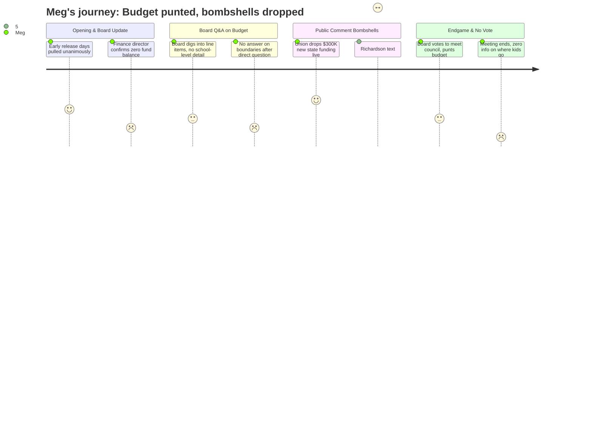

# Interpretation: Meg (PERSONA-011)
## Meeting: School Board Regular Meeting -- April 2, 2026 -- 2026-04-02

---

### Structured Points

#### 1. Early release days pulled before the meeting even started
- **Fact:** The board chair opened by announcing agenda item 4.1 — four early release days in May and June for reconfiguration prep — would be removed from the agenda before any vote. The board voted unanimously to pull it. A waiver for one reduced student day may still be pursued.
- **Source:** Transcript [02:24--08:39]
- **Emotional valence:** positive
- **Threat level:** 2
- **Open question:** true — A one-day waiver is the limit; is that enough prep time for teachers? The board acknowledged two half-days was the original ask.

---

#### 2. District confirmed no fund balance and three straight years of deficits
- **Fact:** Finance director Abigail Ketchen confirmed the district has run deficits in FY24, FY25, and is projecting one in FY26, and that the fund balance is gone. She stated directly: "we have no savings buffer." She used electricity as an example — the district will be approximately $360K over budget on electricity alone for FY26, and won't know the final bill until July or August.
- **Source:** Transcript [15:41--20:24]; Budget presentation slide 6 (FY27 Special Budget Meeting 4.2.26)
- **Emotional valence:** negative
- **Threat level:** 4
- **Open question:** false — The deficit history is confirmed and on the record.

---

#### 3. Union rep dropped $300K in new state funding mid-public-comment
- **Fact:** SSPA president Connie DeSanto announced during public comment that she had just received word — during the meeting — that South Portland would likely receive approximately $300,000 in additional state funding: $150K tied to homeless student population and $150K tied to economically disadvantaged students, attributed to union and staff advocacy in Augusta.
- **Source:** Transcript [122:05--123:39]
- **Emotional valence:** positive
- **Threat level:** 1
- **Open question:** true — Is this confirmed, one-time, or recurring? A board member later received a text suggesting the EPS formula change could yield an additional $750K — contradicting or layering on the $300K figure — and was told it might be a one-year-only funding bump. The two numbers were never reconciled on the record.

---

#### 4. Board voted unanimously to meet with City Council — but punted the budget vote
- **Fact:** The board voted unanimously to convene a meeting with the City Council to seek budget guidance (agenda item 4.2). However, item 4.3 — actually adopting the FY27 budget — was not voted on. At least four board members (Richardson, Holman, Rich, Smith) stated they were not ready to vote. The superintendent warned that without board action, the superintendent's budget — not the board's — goes to council.
- **Source:** Transcript [260:07--279:06]; Agenda item 4.2 and 4.3
- **Emotional valence:** neutral
- **Threat level:** 3
- **Open question:** true — Will the board convene Monday to vote? And if the new state funding figures come in, which positions get restored, and by what process?

---

#### 5. Elementary behavior specialist position still cut — no replacement plan named
- **Fact:** A statement read on behalf of Jenna Goldstein Walsh, the district's elementary general education behavioral strategist (a position recommended for elimination), stated she currently supports four of five elementary schools, worked with nearly 60 students this year, and developed over 40 formal behavior plans. She warned that cutting the role removes a "middle layer" of support between general ed and special ed referral, and that approximately 23% of district students already have IEPs — higher than surrounding districts. Dr. Prince confirmed BCBAs and instructional strategists would absorb this work.
- **Source:** Transcript [101:14--106:07]; [241:35--243:08]
- **Emotional valence:** negative
- **Threat level:** 4
- **Open question:** true — Which four elementary schools does this role currently cover, and who specifically covers the gap at each building next year?

---

#### 6. Reconfiguration boundaries: still no answer on where any child goes
- **Fact:** Multiple board members and public speakers pressed directly on attendance boundaries. Dr. Prince stated the district has not yet drawn boundaries, that family listening sessions are being used to gather priorities first, and that a formal timeline would be published "by the end of next week." A survey went to elementary staff the day after the meeting (April 3) to gather placement preferences. No transportation cost estimates, no boundary maps, and no school assignment criteria were presented.
- **Source:** Transcript [53:46--55:19]; [243:54--244:40]; [247:48--249:18]
- **Emotional valence:** negative
- **Threat level:** 5
- **Open question:** true — When will parents know which school their child attends in September? Will siblings at the same school stay together? What is the cap on bus ride time for elementary-age children?

---

#### 7. Superintendent search: semi-finalists in two weeks, finalist interviews two weeks after
- **Fact:** Board chair confirmed the superintendent search is in progress with a search agency. Semi-finalist interviews are scheduled in approximately two weeks; finalist interviews two weeks after that. The board will select from two or three finalists. The process is closed — candidate names are confidential. The new superintendent would start July 1, inheriting reconfiguration already in motion.
- **Source:** Transcript [239:15--241:02]
- **Emotional valence:** neutral
- **Threat level:** 2
- **Open question:** true — Who is leading reconfiguration decisions between now and July 1? The board chair said the new superintendent is "not really leading anything" — they will "show up with a new plan."

---

### Journey Map

---

### Reactions

ok so big meeting tonight, here's what you actually need to know. they did NOT vote on the budget. board punted. at least 4 members said they weren't ready. that means the budget still isn't official going into the city council presentation tuesday. the superintendent warned them: if they don't act, whatever goes to council is her budget, not the board's. there's supposedly a monday meeting being discussed but it wasn't confirmed. watch for that.

the actual breaking news came from public comment. the SSPA union president stood up mid-meeting and said — while she was sitting there — that she'd just gotten word south portland is likely getting an extra $300,000 from the state. $150K for homeless students, $150K for economically disadvantaged. teachers went to Augusta and apparently it worked. then about an hour later board member richardson got a text saying the EPS formula change could mean an additional $750K for NEXT year's budget. she read it out loud. BUT someone said that's a one-year thing and we won't know the real number for a bit. so: somewhere between $300K and potentially $1M in new money is floating around and nobody reconciled those two figures on the record. the board wanted to know the real number before voting. that's partly why they punted.

the thing that's going to keep coming up in your group chats: still zero information on where your kids go next year. board member feller asked directly about attendance boundaries and dr. prince said they haven't drawn them yet, listening sessions first, formal timeline "by end of next week." no transportation cost estimates, no answer on bus ride length, no answer on whether siblings stay together. one parent asked if kids would be bused across town and the answer was essentially: we'll hear from you first and then figure it out. also: the elementary behavior specialist position (the person who makes behavior plans for kids who need support but don't have IEPs yet) is still being cut. she supports four elementary schools, 60 kids, 40+ formal plans. district says BCBAs and instructional strategists will cover it. the board voted unanimously for one thing tonight: meet with city council. that's tuesday, april 7th.