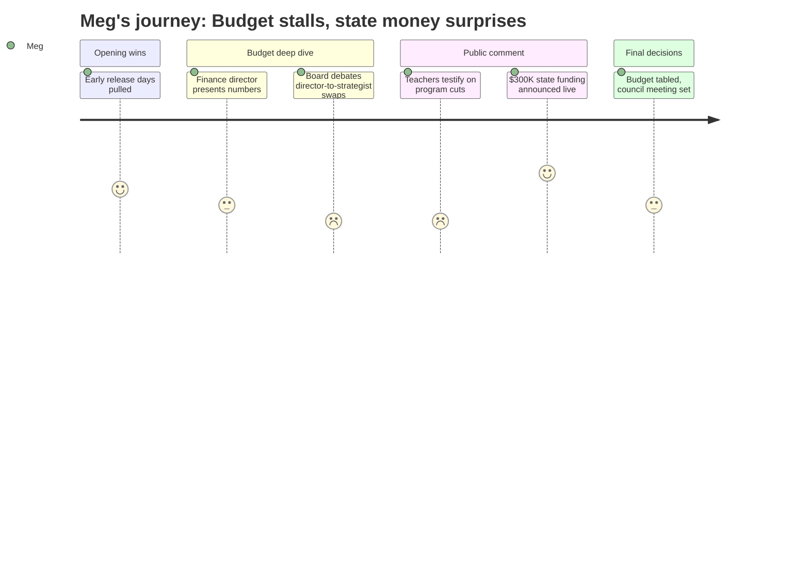

# Interpretation: Meg (PERSONA-011)
## Meeting: School Board Regular Meeting -- April 2, 2026 -- 2026-04-02

### Structured Points

#### 1. Early release days removed — unanimous, done
- **Fact:** The board voted unanimously to remove from the agenda the proposal to add four early release days (May 13, 20, 27, June 3) in preparation for reconfiguration. The board chair accepted the motion after acknowledging the hardship on working families. A state waiver for one fewer student day may be pursued as an alternative, though a board member noted the original request was for two days of prep time.
- **Source:** Transcript [0:02:24]--[0:08:39]
- **Emotional valence:** positive
- **Threat level:** 2
- **Open question:** true — one day of waiver-covered prep may not be enough time for teachers preparing for a full school reconfiguration; no concrete answer on whether existing professional development days can fill the gap.

#### 2. Budget NOT voted on tonight
- **Fact:** The board did not vote to adopt the FY27 budget as the board's proposal to advance to city council. After voting unanimously to convene a meeting with city council (agenda item 4.2), members chose not to act on item 4.3. Multiple members cited the need to wait for confirmed figures on potential new state funding before locking in a budget with deep position cuts.
- **Source:** Agenda slide 1 (items 4.2–4.3); transcript [~4:21:10]--[~4:22:50]
- **Emotional valence:** neutral
- **Threat level:** 3
- **Open question:** true — the board may reconvene Monday before meeting with council Tuesday; which positions come back (if any) and under what process is unresolved.

#### 3. $300K in state funding announced live during public comment
- **Fact:** SSPA president Connie DeSanto announced mid-meeting that she had received word from the state house that South Portland is likely to receive approximately $300,000 in additional state funding — $150,000 tied to its homeless student population and $150,000 for economically disadvantaged students — as a direct result of union leaders lobbying Augusta. Later in board deliberations, member Richardson mentioned receiving a separate text suggesting an additional $750,000 may be coming from changes to the state EPS funding formula.
- **Source:** Transcript [1:22:05]--[1:23:51] (DeSanto); transcript [~4:11:00] (Richardson's text from Rep. Kessler)
- **Emotional valence:** positive
- **Threat level:** 2
- **Open question:** true — neither figure is confirmed; the EPS number was described as one-time by at least one source; no board action has been taken on how to allocate either amount.

#### 4. Budget vote and reconfiguration vote are legally separate
- **Fact:** Board chair DeAngelis stated explicitly at the opening of the meeting that voting down the budget on June 9 does not reverse or affect the board's reconfiguration vote from Monday. "Those are two separate issues." Even if the budget fails, the district would revert to the prior year's budget (approximately $2.5 million less) and reconfiguration would remain in effect.
- **Source:** Transcript [0:09:24]--[0:10:11]
- **Emotional valence:** negative
- **Threat level:** 3
- **Open question:** false — the legal relationship is clear, though community members are still processing it.

#### 5. Elementary behavioral strategist position eliminated — 4 schools affected
- **Fact:** A statement read on behalf of Jenna Goldstein Walsh, the district's elementary general education behavioral specialist, stated that her position — which provided direct support to nearly 60 individual students across Brown, Small, Dyer, and Kaler this year, including more than 40 formal behavior plans — is proposed for elimination. She warned the cut removes the "middle layer" of behavioral intervention for students not yet in special education, likely accelerating special ed referrals and costs. No specific staff member was identified as absorbing her caseload.
- **Source:** Transcript [1:01:14]--[1:06:07]
- **Emotional valence:** negative
- **Threat level:** 4
- **Open question:** true — administration cited BCBAs and instructional strategists as replacements but did not specify who takes on the 40+ active behavior plans at those four schools.

#### 6. SPMS related arts program cut deeply — named teachers losing positions
- **Fact:** Multiple speakers confirmed that under the current budget, South Portland Middle School is losing its computer science teacher (Mr. Wetzel), two physical education teachers (including the unified/adaptive PE teacher who runs Special Olympics and unified basketball), one of two STEM teachers, and the percussion educational technician who serves 70 students directly and supports 500 instrumental students in grades 5–12. Mr. Wetzel spoke at the meeting; his daughter, a high school student, spoke immediately before him.
- **Source:** Transcript [1:25:57]--[1:28:15] (Lori Melton); [1:54:42]--[1:56:15] (Mr. Wetzel); [1:58:56]--[2:01:15] (Jen Fletcher, PE); [2:09:44]--[2:12:08] (Eva Morin, student)
- **Emotional valence:** negative
- **Threat level:** 3
- **Open question:** true — unclear whether any of these positions would be restored if new state funds are directed to staffing.

#### 7. Attendance boundaries still unknown — no timeline given
- **Fact:** Multiple community members asked directly where their children will be going to school next year. Dr. Prince stated that the district has not yet determined attendance boundaries and that family listening sessions — 13 total, at each school, plus two online — are intended to inform that process. She explicitly said she did not want to "get ahead of hearing those voices." No go-live date for boundary decisions was announced.
- **Source:** Transcript [0:53:46]--[0:55:19] (Prince on priorities); public comment generally; transcript [~4:43:00] (board Q&A response on boundaries)
- **Emotional valence:** negative
- **Threat level:** 4
- **Open question:** true — families with multiple children, special education needs, or childcare constraints are making summer plans with no information on school assignments.

#### 8. Bus driver safety risk flagged — district already short two drivers
- **Fact:** Bus driver union representative Susan Liden Smith told the board that the district is already down two bus drivers whose positions won't be filled due to budget cuts. She warned that the proposal to have bus drivers assist with lunchroom setup and breakdown poses an injury risk — noting six existing injuries, including three shoulder surgeries, among staff doing similar physical tasks — and that drivers are already looking for other jobs. A separate speaker (Jen Fletcher) confirmed no clear staffing plan for lunch supervision at elementary schools.
- **Source:** Transcript [1:24:25]--[1:25:11] (Liden Smith); transcript [1:19:29]--[1:20:00] (Jen Fletcher, SPTA VP)
- **Emotional valence:** negative
- **Threat level:** 3
- **Open question:** true — if bus driver negotiations fail, administration stated the district would need to find approximately $320,000 elsewhere to restore five custodial positions.

---

### Journey Map

---

### Reactions

ok 5-hour meeting, here's what actually happened. board did NOT vote on the budget tonight — they voted unanimously to go meet with city council tuesday (and possibly convene again monday) before making a final call. the reason they pumped the brakes: during public comment, SSPA president connie desanto announced MID-MEETING that she got word from the state house that south portland is likely getting an extra $300k — $150k for our homeless student population and $150k for economically disadvantaged kids, because union leaders went to Augusta and lobbied for it. then, during board deliberations, member richardson said she got a TEXT from rep. kessler saying there could be another $750k coming from changes to the state EPS formula. none of that is locked in — "likely" and "potentially" were the words used — but you can see why some board members weren't willing to vote on a budget with deep cuts when that money might bring positions back. early release days: REMOVED, unanimous, done. those 4 days in may and june are gone.

one thing to be clear on if you're in a group chat talking about voting no on the budget in june: board chair said explicitly at the very start that it does NOT change the reconfiguration vote. those are two different actions. if the budget fails, the board has to work within last year's numbers (which is actually $2.5M less), but closing kaler and reconfiguring grades still stands. voting no is a pressure move, not a reversal.

for the elementary parents in my threads: still no answer on where your kids are going next year. dr. prince said they haven't set boundaries yet — listening sessions are happening at each school next week and online, and a survey is open. if you want your priorities heard before they draw the map, that's your window. the behavioral strategist position that covers brown, small, dyer, and kaler — that's on the chopping block. someone read her statement tonight: she worked with almost 60 kids this year, over 40 formal behavior plans, and she said flat out "eliminating this role does not eliminate those needs." no one named who picks up her caseload. for the middle school families: computer science will not exist as a class next year under the current proposal. also losing 2 PE teachers including the one who runs special olympics and unified basketball, one of two STEM teachers, and the percussion ed tech who teaches 70 kids and supports the whole grades 5–12 band program. mr. wetzel spoke tonight. his daughter is at the high school and she went to the mic first. the room was completely gutted. if any positions come back with that state money, there's no process in place yet for deciding which ones.