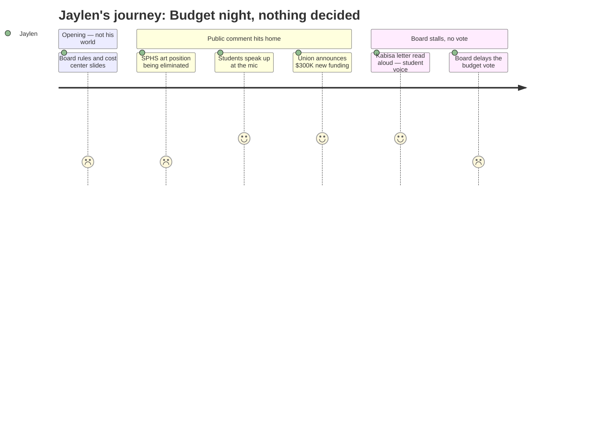

# Interpretation: Jaylen (PERSONA-012)
## Meeting: School Board Regular Meeting -- April 2, 2026 -- 2026-04-02

---

### Structured Points

#### 1. SPHS Art Department Dropping from Four to Three Teachers
- **Fact:** Art teacher Matt Meyer testified that after a full-time position was quietly cut to half-time over the summer, the district is now proposing to eliminate that position entirely -- taking the high school art department from four teachers to three. He noted that SPHS enrollment has not declined by 25%, and that students who had signed up for art this year were turned away because of the mid-summer reduction.
- **Source:** Public comment, transcript [109:50–112:09]
- **Emotional valence:** negative
- **Threat level:** 4
- **Open question:** true — Does this affect theater? Are there other SPHS arts positions at risk that weren't named tonight?

#### 2. Two Students Actually Got Up and Spoke
- **Fact:** Lucy Hutzel, a high school student, testified about her father's computer science position being cut at the middle school. She stated directly: "computer science is available this year and will not be available next year under this proposal." A second student speaker, Eva Morin, spoke about related arts and how middle school computer science opened her eyes to a possible career. Both explicitly said students would be lining up to speak if they knew what was happening.
- **Source:** Transcript [151:38–156:15]; [209:44–212:08]
- **Emotional valence:** positive
- **Threat level:** 2
- **Open question:** true — Why don't more students know about this? How do they find out when the district doesn't tell them?

#### 3. A Board Member Is a Student — and She Sent a Letter About the Arts
- **Fact:** Board member Angela Kabisa, a high school senior who couldn't attend because "people lied when they said senior year would be easy," submitted a written statement that was read aloud. She specifically called out the importance of arts, the percussion ed tech, and ed tech roles for students who need to feel seen and connected in school.
- **Source:** Transcript [227:38–230:42]
- **Emotional valence:** positive
- **Threat level:** 2
- **Open question:** true — Does Kabisa's voice carry real weight on how the board votes, or is she just one of nine?

#### 4. Middle School Related Arts Was Gutted -- Those Students Are Coming to SPHS
- **Fact:** Multiple speakers described the elimination of the middle school's computer science teacher, one of two STEM teachers, a percussion ed tech, and a 50% reduction in PE access (from year-round to one semester). Speaker Jen Fletcher noted that 71% of SPMS students currently participate in year-round PE, and that the remaining related arts staff were given no rationale and no information on how they'd cover more classes with fewer colleagues.
- **Source:** Transcript [125:57–128:15]; [196:09–198:55]; [199:41–202:03]
- **Emotional valence:** negative
- **Threat level:** 3
- **Open question:** true — Will these students arrive at SPHS two or three years from now with less exposure to arts, music, and CS? Does that affect what the high school can offer?

#### 5. Union Lobbyists Got $300,000 in New State Money -- During the Meeting
- **Fact:** During public comment, union president Connie DeSanto announced that union staff had traveled to Augusta and lobbied lawmakers, resulting in approximately $300,000 in new state funding for economically disadvantaged and homeless students. Later in deliberations, board member Richardson received a text suggesting a possible additional $750,000 from state EPS formula changes -- though that figure was described as uncertain and potentially one-time.
- **Source:** Transcript [122:05–123:39]; [264:20]
- **Emotional valence:** positive
- **Threat level:** 1
- **Open question:** true — Board member Richardson said explicitly she wants that money for "teachers and staff, no director positions." Will the board actually use new funding to restore student-facing positions?

#### 6. The Board Did Not Vote on the Budget
- **Fact:** After nearly five hours, the board chose not to vote on adopting the FY27 budget (agenda item 4.3). Members cited the late-breaking state funding news and a desire to meet again Monday before deciding. The board did vote unanimously to convene a meeting with city council to seek budget guidance. No positions were restored, and no cuts were reversed.
- **Source:** Transcript [260:01–279:09]; Agenda item 4.3
- **Emotional valence:** neutral
- **Threat level:** 3
- **Open question:** true — After five hours, nothing changed. Does delaying actually help, or does it just mean more weeks of not knowing?

---

### Journey Map

---

### Reactions

So basically I stayed up watching the stream last night because my cross-country coach texted me that something was going down with the arts budget at our school. And yeah — there's an art teacher position at SPHS that's getting cut. We went from four art teachers to three, except one of them was already cut to half-time over the summer, and now they want to get rid of that position completely. An art teacher literally came and testified about it. He said students who tried to sign up for art this year couldn't get in because the position got reduced mid-summer. Like, nobody told students that. We just found out we couldn't take the class. And now it might not exist at all next year.

The thing that actually got me was two students showed up and spoke. One girl, Lucy — she's in high school — got up there to talk about her dad's computer science job being cut at the middle school. And there was another girl, Eva, who said computer science in middle school literally changed what she wants to do with her life. Both of them said students would be lining up outside the building if they knew what was at stake. And that's exactly the thing that messes with me — we DON'T know. Nobody told us. I found out from my coach, not from the school. The board has been meeting about this for months and the assumption is we're just not part of the conversation.

There's also something kind of wild — Angela Kabisa, one of the board members, is literally a high school senior and she couldn't be there because she was dealing with school. They read her letter out loud and she talked about the arts and percussion ed tech and why those things matter to students. Which, yeah, obviously. But here's the thing: the board met for almost five hours and didn't actually vote on anything. They heard everyone out, said the word "equity" approximately a thousand times, found out there might be $300K in new state money coming in, and then just... kicked it to Monday. Nothing got decided. No positions came back. My senior year is still a question mark.