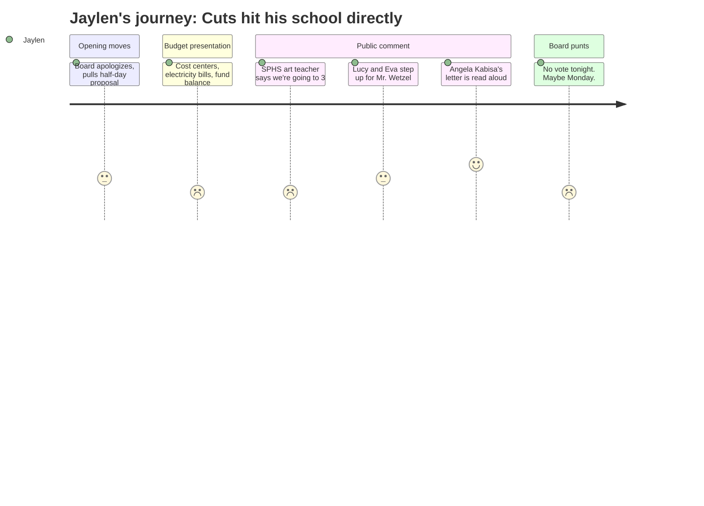

# Interpretation: Jaylen (PERSONA-012)
## Meeting: School Board Regular Meeting -- April 2, 2026 -- 2026-04-02

### Structured Points

#### 1. The SPHS Art Department Is Losing a Teacher
- **Fact:** Art teacher Matt Meyer testified that South Portland High School started the year with four full-time art teachers, lost one mid-summer, replaced that position with a half-time hire (Hannah Schultz), and now that half-time position is proposed for elimination entirely -- dropping the department from four to three. Meyer noted SPHS enrollment has not declined by 25%, making the cut disproportionate.
- **Source:** Transcript [109:50--112:09]
- **Emotional valence:** negative
- **Threat level:** 4
- **Open question:** true

#### 2. A Board Member Is a High School Student -- and She Couldn't Be There
- **Fact:** Board member Angela Kabisa, identified as a SPHS senior, submitted a written statement read aloud by member Dowling. She specifically named the DEI position, the percussion ed tech, and arts programs as things that make students feel "seen and understood." She noted these are not easy decisions but asked the board to listen to the public and remember their goal is to serve students.
- **Source:** Transcript [227:38--230:42]
- **Emotional valence:** positive
- **Threat level:** 2
- **Open question:** true

#### 3. Two High School Students Stood at the Microphone
- **Fact:** Eva Morin, a student at SPHS, spoke on behalf of the computer science teacher at the middle school and the percussion ed tech, saying these teachers shaped her interests and gave students a sense of belonging. Lucy Hutzel, also identified as a SPHS student, spoke about her father, Mr. Wetzel, whose computer science position at the middle school is proposed for elimination. Mr. Wetzel then spoke directly after his daughter.
- **Source:** Transcript [152:24--156:15], [209:44--212:08]
- **Emotional valence:** neutral
- **Threat level:** 2
- **Open question:** false

#### 4. Middle School Related Arts Are Being Gutted -- Computer Science Gone Entirely
- **Fact:** Multiple teachers testified that South Portland Middle School is losing one PE teacher, the computer science teacher, a percussion ed tech, and a STEM teaching position. A teacher described a seventh-grader who said she had never been down the STEM hallway in three years at the school. Computer science will not be available as a class at SPMS next year under this budget.
- **Source:** Transcript [125:57--130:10], [196:34--202:03], [155:29--156:15]
- **Emotional valence:** negative
- **Threat level:** 3
- **Open question:** true

#### 5. SPHS Co-Curricular Stipends Are Being Cut by Over $27,000
- **Fact:** The budget book shows SPHS co-curricular stipends dropping from $106,470 in FY26 to $78,840 in FY27 -- a reduction of $27,630. These stipends fund extracurricular advisors at the high school level, including activities-based roles that sit outside the main teacher salary line.
- **Source:** Budget Book 4.2.26 [document], row 1864
- **Emotional valence:** negative
- **Threat level:** 4
- **Open question:** true

#### 6. Up to $1 Million in New State Funding May Be Coming -- But Nobody Has the Number
- **Fact:** During public comment, SSPA president Connie DeSanto announced that union members' advocacy in Augusta had secured a likely additional $300,000 in state aid (split between homeless and economically disadvantaged student populations). Board member Richardson later shared a text from a state representative suggesting an additional $750,000 from EPS formula changes -- though she noted conflicting figures and that the increase may be one-year only.
- **Source:** Transcript [122:51--123:39], [264:20--265:08]
- **Emotional valence:** positive
- **Threat level:** 1
- **Open question:** true

#### 7. The Budget Was Never Voted On -- Senior Year Is Still Unresolved
- **Fact:** The board voted unanimously to convene a meeting with city council (item 4.2) but took no action on item 4.3, adopting the FY27 budget. Board members said they wanted to wait for accurate figures on potential new state funding before deciding. A possible Monday meeting was mentioned but not confirmed. The superintendent noted that without board action, what advances to the council is the superintendent's budget, not the board's.
- **Source:** Transcript [272:50--279:06], Agenda Item 4.3
- **Emotional valence:** neutral
- **Threat level:** 3
- **Open question:** true

#### 8. The Entire Presentation Was in Language That Maps to Nothing Students Experience
- **Fact:** The budget presentation and document organize all spending by cost center codes (Regular Instruction, Special Education, Transportation, Facilities) and by building. No part of the presentation described what students would find or lose at their school next year -- no mention of specific courses, activities, or programs by name. The only student-legible information came from teachers and students during public comment, not from district administration.
- **Source:** Budget Book 4.2.26 [document]; Transcript [14:10--21:12]
- **Emotional valence:** negative
- **Threat level:** 2
- **Open question:** true

---

### Journey Map

---

### Reactions

Okay so the art department at our school is going down to THREE teachers. We started with four, they replaced one with a half-time person over the summer -- which was already bad because kids who signed up for art couldn't even get in -- and now they're cutting that half-time position completely. An art teacher literally stood up and said "please don't do this" and listed the reasons and the board just... sat there. That's Jaylen's school. That's where I go. I still don't know if the classes I'm planning for senior year are going to exist. Nobody from the administration said one word about what SPHS students are going to see change. I had to piece it together from a public comment.

The part that actually got me though was the two students who got up. Lucy Hutzel went to the mic and talked about her dad, Mr. Wetzel -- the computer science teacher at the middle school who's getting cut -- and then he got up right after her and he was just like, barely holding it together. And Eva Morin, who's a junior like me, she talked about how that same teacher changed what she wanted to do with her life. That's what these cuts actually are. Not "cost center one" or whatever. And the whole time, nobody from the board asked a single question like "okay so what does a student at SPHS actually lose here." Angela Kabisa, who is literally on the school board and is a senior at our school, couldn't even be there -- she sent a letter. Her letter was the only official voice in that room that sounded like it knew what school actually feels like.

And then at the end, they just didn't vote. Like, all of this, four hours of people crying at the microphone, and they said "we might meet Monday, we don't know." There's apparently maybe $300,000 or maybe a million in new state money coming -- teachers went to Augusta and asked for it, which is wild -- but the board doesn't have the exact number so they punted. Which I get, kind of. But from where I'm sitting, I still don't know if theater has a future next year, I don't know if the newspaper can even get answers about what's changing at our school, and the budget document they're all arguing over is written in a language where you literally cannot find the word "theater" or "AP" anywhere. If I'm writing something for the school paper, I have nothing official to quote. Everything I know came from the teachers who showed up and were brave enough to say it out loud.