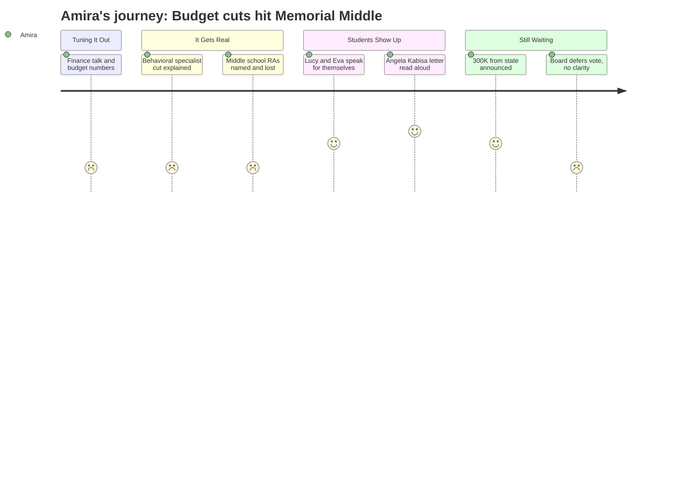

# Interpretation: Amira (PERSONA-013)
## Meeting: School Board Regular Meeting -- April 2, 2026 -- 2026-04-02

### Structured Points

#### 1. The percussion ed tech who holds band together is being cut
- **Fact:** A PE teacher, Jen Fletcher, described the percussion educational technician as someone who "instructs 70 students and supports 500 instrumental students grade 5 through 12" — and noted that this person is proposed for elimination. A student named Eva Morin also spoke in defense of this role, saying it is "a core part of our school for a very long time."
- **Source:** Public comment, Jen Fletcher and Eva Morin; also referenced by Lori Melton
- **Emotional valence:** negative
- **Threat level:** 5
- **Open question:** true

#### 2. A student board member wrote that music and ed techs are what make students feel seen
- **Fact:** Board member Angela Kabisa, a high school senior who could not attend, submitted a written statement read aloud at the meeting. She wrote that the DEI position, music programs, and ed techs "help build a school environment where everyone feels like they belong," and that she has "experienced it as a new music student." She urged the board to listen to the public and remember that "no matter what race, where you're from," every voice matters.
- **Source:** Board member Kabisa written statement, read at public comment segment
- **Emotional valence:** positive
- **Threat level:** 1
- **Open question:** false

#### 3. Two students came to the microphone and said what they actually think
- **Fact:** Lucy Hutzel, a high school student, spoke in defense of her father Mr. Wetzel, the computer science teacher being cut. Eva Morin, another student, spoke about the percussion ed tech and computer science: "This class helped me realize that computer science is an interest I might have... that it could possibly be a career choice for me." Both students addressed the board directly.
- **Source:** Public comment, Lucy Hutzel and Eva Morin
- **Emotional valence:** positive
- **Threat level:** 2
- **Open question:** true

#### 4. The middle school is losing computer science, one PE teacher, stem, and more related arts
- **Fact:** Multiple speakers described Memorial Middle School losing its computer science teacher (Mr. Wetzel), one of two STEM teachers, a PE teacher who also coaches adaptive PE and unified basketball (Mr. Lanson), the percussion ed tech, and an art position. A teacher also mentioned that a seventh-grade student near the end of her third year at the middle school had never once been to STEM or art class.
- **Source:** Public comment, Lori Melton and Jen Fletcher; board member Holman comment during board discussion
- **Emotional valence:** negative
- **Threat level:** 5
- **Open question:** true

#### 5. $300,000 might be coming from the state — and board members said it should go to staff
- **Fact:** A union representative named Connie DeSanto announced during public comment that staff advocacy in Augusta had secured a potential $300,000 in additional state funding — $150,000 tied to the district's homeless student population and $150,000 for economically disadvantaged students. Several board members said they wanted any new money directed to restoring staff positions, not administrative roles or the fund balance.
- **Source:** Public comment, Connie DeSanto; board member Richardson comment following public comment
- **Emotional valence:** positive
- **Threat level:** 2
- **Open question:** true

#### 6. The person who helps struggling kids before they need special ed is being eliminated
- **Fact:** A statement read on behalf of Jenna Goldstein Walsh, the district's elementary general education behavioral specialist, described working with nearly 60 students this year — over 40 with formal behavior plans. Her statement warned: "Eliminating this role does not eliminate those needs. It removes the system we have in place to respond to them... students will either receive no meaningful behavioral support in general education or they will be referred for special education. There is no in between."
- **Source:** Public comment, statement read by Nicholas Boggs on behalf of Jenna Goldstein Walsh
- **Emotional valence:** negative
- **Threat level:** 4
- **Open question:** true

#### 7. A teacher said students are being sent to guidance instead of being told the truth about who's leaving
- **Fact:** Teacher Laura Stevens said it had felt "disingenuous" to direct students to guidance when they asked why beloved teachers weren't returning, rather than giving students a voice. She said, "I kind of feel like maybe that was by design." She named specific teachers — Ms. Watson, Ms. Heller, Mr. Wetzel — and said if students knew, "there would be a line out the door."
- **Source:** Public comment, Laura Stevens
- **Emotional valence:** negative
- **Threat level:** 3
- **Open question:** true

---

### Journey Map

---

### Reactions

Mom, I watched a big part of the school board meeting. A lot of it was really confusing — people kept talking about fund balances and electricity bills and stuff I honestly had no idea what it meant. But then it got to the part where parents and teachers started coming up to the microphone and it changed. One of the things that scared me the most: they're cutting the percussion ed tech. You know how I'm in band? This person supports like 500 students in band from fifth grade all the way to twelfth grade. A student named Eva actually came and talked about it — she said computer science opened up a possible career for her and that "related arts are what make school fun." She's right. And a teacher said there's a seventh grader at the middle school who has literally never been to STEM or art in three years. Three years. And now they're cutting more of it.

The part I didn't expect — there's a student on the school board. Her name is Angela Kabisa and she's a senior so she couldn't come, but someone read her letter out loud. She talked about the music program and the ed techs and the DEI position and she wrote that those are the things that make students feel seen and like they belong. She said she experienced it herself as a music student. It felt like the only person in that room who actually said it from the inside. Also, two students — Lucy and Eva — just walked up to the microphone and spoke. I didn't know you could do that. When the library hours got cut last year I wrote a letter to the principal and got back basically nothing. These kids went and stood in front of the whole board and said exactly what they thought.

At the very end they said there might be $300,000 coming from the state because teachers actually went to Augusta and asked for it. Some board members said that money should go back to staff — not director roles, not the fund balance, staff. But they didn't actually vote on anything or say which positions might come back. Mr. Wetzel, the computer science teacher — he stood up after his daughter finished speaking and said tomorrow he goes back into the hallways and still won't know what to tell his students. That's the part I keep thinking about. Because that's me too. I find out things about my school from other kids in the hallway, not from anyone who's actually supposed to tell me. And it sounds like nobody's going to fix that part.