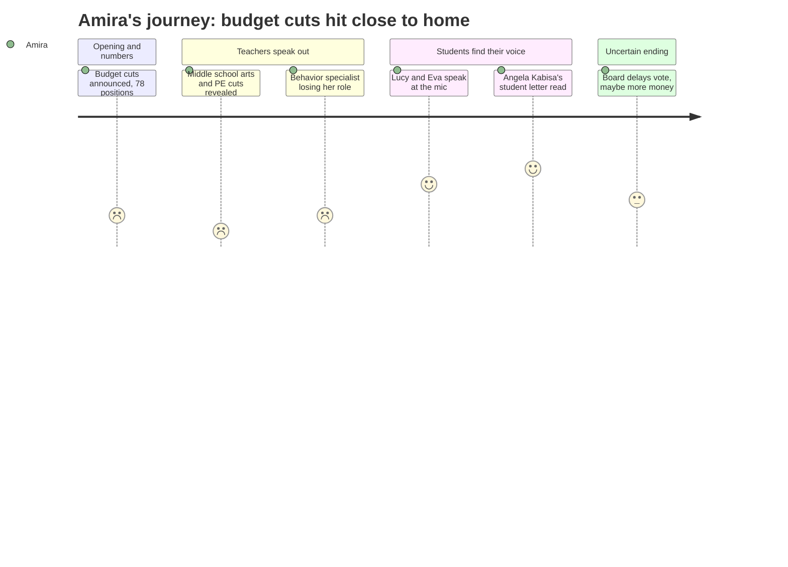

# Interpretation: Amira (PERSONA-013)
## Meeting: School Board Regular Meeting -- April 2, 2026 -- 2026-04-02

### Structured Points

#### 1. The percussion ed tech is being cut — and he supports all of band
- **Fact:** Multiple teachers at public comment described the percussion ed tech as supporting 500 instrumental students from grades 5 through 12. One speaker said he's been part of the school "since before the previous band teacher, who was here for over 30 years." His elimination is part of the 78-position reduction in force.
- **Source:** Eva Morin (student, public comment); Jen Fletcher (SPMS PE teacher, public comment); Lori Melton (SPMS teacher, public comment)
- **Emotional valence:** negative
- **Threat level:** 5
- **Open question:** true

#### 2. Computer science and related arts at the middle school are gone
- **Fact:** Under the proposed FY27 budget, computer science will be eliminated entirely as a class at South Portland Middle School, along with cuts to PE (reduced to one semester), one STEM teacher, and other related arts positions. A teacher explicitly stated: "Computer science is available this year and will not be available next year under this proposal."
- **Source:** Mr. Wetzel (SPMS CS teacher, public comment); Lori Melton (SPMS teacher, public comment); Jen Fletcher (SPMS PE teacher, public comment)
- **Emotional valence:** negative
- **Threat level:** 5
- **Open question:** true

#### 3. The specialist who helps struggling kids — before they need special ed — is being eliminated
- **Fact:** A statement was read aloud on behalf of the district's elementary general education behavioral strategist, whose position is being cut. She stated she worked directly with nearly 60 students this year, designing behavior plans and social-emotional supports. She warned: "Eliminating this role does not eliminate those needs. It removes the system we have in place to respond to them."
- **Source:** Nicholas Boggs reading Jenna Goldstein Walsh's statement, public comment
- **Emotional valence:** negative
- **Threat level:** 5
- **Open question:** true

#### 4. Her gifted-and-talented program appears to be unchanged in the budget
- **Fact:** The Academically Gifted cost center in the FY27 budget maintains 3.00 teacher FTEs and $385,661 in funding — identical to the FY26 FTE count. No speakers raised concerns about this program during the meeting.
- **Source:** FY27 Budget Book, Academically Gifted section, rows 673–684
- **Emotional valence:** positive
- **Threat level:** 1
- **Open question:** false

#### 5. A student is actually on the school board — and she agrees about belonging
- **Fact:** Board member Angela Kabisa, a high school senior who could not attend because "people lied when they said senior year would be easy," sent a written letter that was read aloud. She wrote that reconfiguration "affects students' everyday lives" and that arts programs and ed techs "give students a place to express themselves, build confidence, and feel connected to something bigger."
- **Source:** Angela Kabisa letter, read by member Dowling during school board communications
- **Emotional valence:** positive
- **Threat level:** 1
- **Open question:** false

#### 6. People got to vote on the turf field — but not on cutting schools or programs
- **Fact:** A community member pointed out that residents were asked to vote on whether the athletic field should be artificial turf or real grass, but are not being given an equivalent direct vote on closing a school or reconfiguring the district. He said: "I feel like this is a much more substantial and divisive issue that should be put up to a vote."
- **Source:** Vladimir Corian (small school parent, public comment)
- **Emotional valence:** negative
- **Threat level:** 2
- **Open question:** true

#### 7. Some state money might come back — and teachers went to Augusta to get it
- **Fact:** The president of the support staff union announced during public comment that union leaders had traveled to Augusta and lobbied state legislators, resulting in a likely additional $300,000 in state funding for economically disadvantaged and homeless students. Board member Richardson later said she wanted that money to go toward restoring staff positions, not director roles.
- **Source:** Connie DeSanto (SSPA president, public comment); board discussion following item 4.2
- **Emotional valence:** positive
- **Threat level:** 2
- **Open question:** true

---

### Journey Map

---

### Reactions

So Mama, I watched some of that school board meeting — Ms. Kamara shared the link in class and I finally got through most of it. It's really bad. They're cutting the percussion ed tech at our school — that's Mr. Hodgkins, who does percussion for band. This teacher who spoke, Ms. Fletcher, said he works with 500 students, from fifth grade all the way up to twelfth. That's basically the whole band program. If he's gone, what even happens to the students who play drums? I've been in band for two years. Nobody told us this was happening. I found out from Ms. Fletcher speaking at a public meeting, not from school.

And it's not just band. Computer science at the middle school is completely gone next year — not smaller, gone. There was this high school girl named Lucy Hutzel who came to the microphone and talked about how her dad is the CS teacher, Mr. Wetzel, and how he started the eSports club and does all this extra stuff for kids. She said she's never embarrassed to say he's her dad. And then Mr. Wetzel got up after her and he could barely finish talking. He said tomorrow he has to go back to school and face those students and still not know what to say. That part was really hard to listen to. The thing I keep thinking about is — the district can afford to put in a new turf field and people got to vote on that, but they can't afford to keep a computer science class? One of the parents literally said that at the meeting, that they voted on AstroTurf versus real grass but nobody gets a vote on this.

The one thing that actually made me feel a little better was finding out there's a student on the school board. Her name is Angela Kabisa and she's a senior, and she couldn't come because of school stuff, so someone read her letter out loud. She wrote that arts programs and ed techs help students feel like they belong, and that reconfiguration affects students' everyday lives. She said "your voice matters, no matter your race or where you're from." She's literally our age and she's on the board. I didn't even know that was possible. I wish she could have been there in person. Because honestly the rest of the adults in that room — I don't think most of them know what it actually feels like to be in our hallways right now.