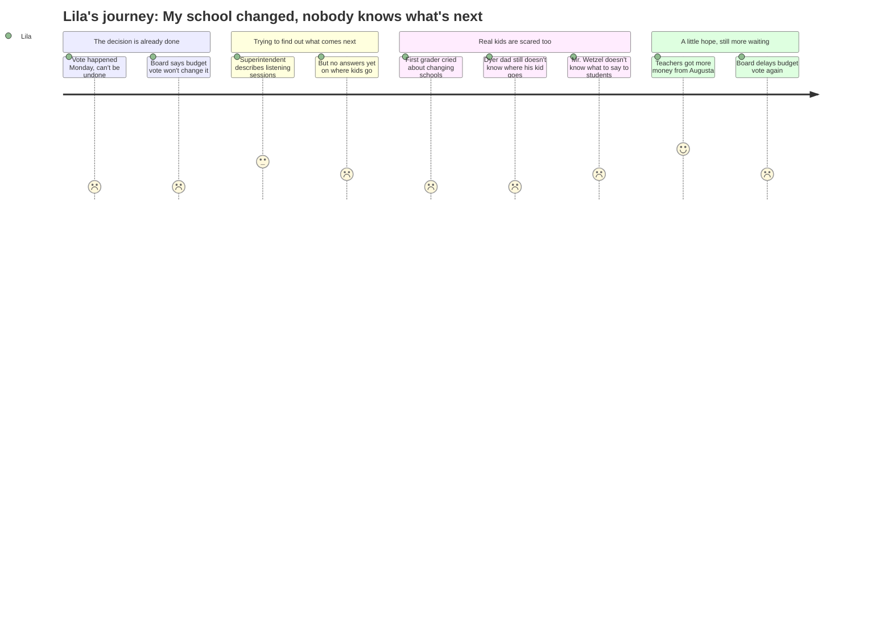

# Interpretation: Lila (PERSONA-014)
## Meeting: School Board Regular Meeting -- April 2, 2026 -- 2026-04-02

### Structured Points

#### 1. The Vote Already Happened — Before This Meeting Even Started
- **Fact:** The board chair opened the meeting by acknowledging "significant reaction to the board's vote on reconfiguration, which occurred Monday night." The decision to reconfigure all elementary schools was final before the April 2 meeting began. This meeting could not undo it.
- **Source:** [02:24]
- **Emotional valence:** negative
- **Threat level:** 5
- **Open question:** false

#### 2. Nobody Knows Where Dyer Kids Are Going Next Year
- **Fact:** Parent Vladimir Corian stated plainly that "none of the parents know where their children are gonna go next year." The superintendent confirmed the district is still "meeting with the transportation company" and working to identify student placements, hoping to publish a formal timeline only "by the end of next week."
- **Source:** [134:31], [52:13]
- **Emotional valence:** negative
- **Threat level:** 5
- **Open question:** true

#### 3. A Kid Just Like Lila Already Cried About This
- **Fact:** Parent Kate LaTuro described telling her first grader the morning after the vote that schools were changing. The child "crumbled" and said, "I just started there. I have to change schools." Then asked: "Mama, what school I go to? Will my friends be there? And will the teachers I know be there?" LaTuro's answer: "I don't know. I don't know. I'm sorry. I don't know."
- **Source:** [175:30]
- **Emotional valence:** negative
- **Threat level:** 4
- **Open question:** true

#### 4. A Dad Who Walks His Kid to Dyer Doesn't Know What Happens Either
- **Fact:** Charlie Fox, whose son attends Dyer, asked the board directly: "my son goes to Dyer. So does that mean Dyer is gonna go to Skillin now?" He described walking his son to school that week and said "all the parents who have first graders were devastated that their kids will not be going to Dyer next year."
- **Source:** [206:38], [207:24]
- **Emotional valence:** negative
- **Threat level:** 5
- **Open question:** true

#### 5. Beloved Teachers Are Leaving — Including Some Who Know You by Name
- **Fact:** The board confirmed 13 elementary teachers are eliminated in the proposed budget. Public speakers named teachers who run after-school clubs, coach sports, and build lasting relationships with students. Computer science teacher Mr. Wetzel stood at the microphone and said: "Tomorrow I will return to the hallways and I will face these students and still not know what to say."
- **Source:** [57:42], [155:29]
- **Emotional valence:** negative
- **Threat level:** 4
- **Open question:** true

#### 6. They're Going to Listen Now — But the Vote Was Already Done
- **Fact:** The superintendent described 13 upcoming listening sessions at each school for families and staff, with a family survey already open. But parent Aiden Rehan noted: "This is the first time we have had a question about change management — before, after we have voted to undergo the change." The listening comes after the decision.
- **Source:** [50:40], [149:15]
- **Emotional valence:** neutral
- **Threat level:** 3
- **Open question:** true

#### 7. Some Teachers Went to Augusta and Got More Money Back
- **Fact:** Union representative Connie DeSanto announced mid-meeting that staff advocacy at the state house had secured a likely additional $300,000 in state funding for South Portland. Board member Richardson later relayed a possible additional $750,000 from EPS formula changes. Board members responded that they wanted this money used for staff positions.
- **Source:** [122:51], [264:20]
- **Emotional valence:** positive
- **Threat level:** 1
- **Open question:** true

#### 8. The Budget Still Wasn't Decided — More Waiting
- **Fact:** Despite being the meeting's main purpose, the board did not vote on the FY27 budget. They voted unanimously to meet with the city council and deferred the budget vote, with a possible Monday meeting pending new information. Board member Richardson said: "I know I'm not in a position to wanna approve this budget tonight."
- **Source:** [267:25], [272:50]
- **Emotional valence:** neutral
- **Threat level:** 2
- **Open question:** true

---

### Journey Map

---

### Reactions

My mom came home from the meeting last night and she looked really tired. I asked her if they said where I'm going to school next year and she said not yet. Not yet again. She's been saying that for weeks. There was a mom at the meeting who said her little kid started crying when she found out about the schools changing. The mom couldn't even answer where her kid was going to go. She just kept saying I don't know, I don't know, I'm sorry. That's what my parents say too.

There was also a dad who walks his kid to Dyer like my dad does. He asked them is his kid gonna have to go all the way to Skillin. They didn't really answer. At recess me and my friends keep trying to figure out what's happening but nobody knows. Zoe said we're going to Brown but Maya said no it's Skillin and I don't even know who to believe. The grownups at the meeting don't know either. The lady in charge said they hope to tell people in like a week or something.

The only good thing my mom told me is that some teachers drove to Augusta — that's the big government place — and they asked for more money and it actually worked a little bit. So maybe some teachers who were gonna have to leave get to stay. I really hope my teacher stays. She's been my teacher for two years and she knows everything about me, like how I like to sit by the window and how fractions make me nervous. I don't want to go to a new school with a new teacher who doesn't know any of that yet.