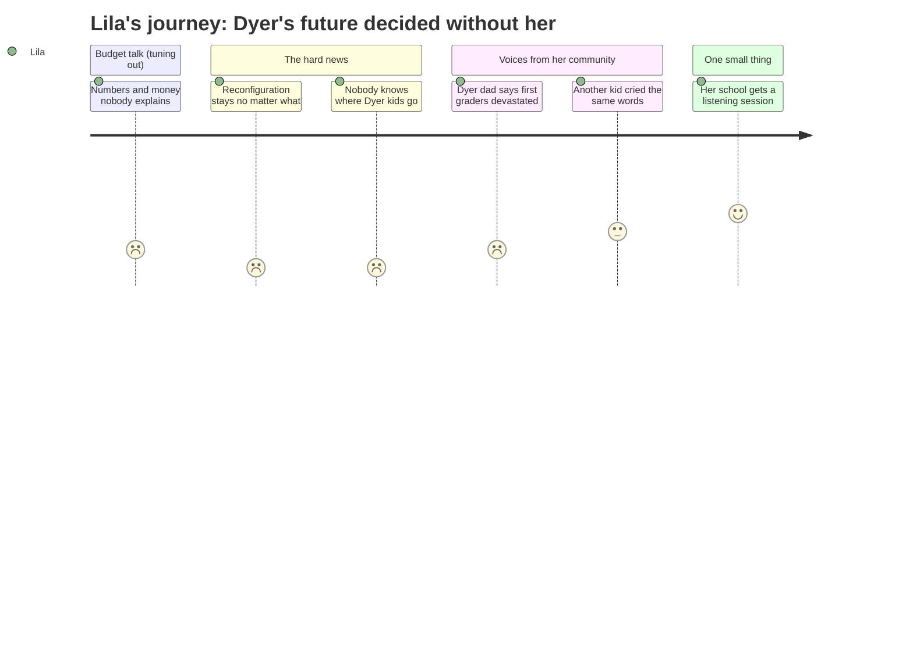

# Interpretation: Lila (PERSONA-014)
## Meeting: School Board Regular Meeting -- April 2, 2026 -- 2026-04-02

---

### Structured Points

#### 1. Dyer is changing no matter what
- **Fact:** The board chair stated clearly that the vote to reconfigure elementary schools is a separate action from the budget vote. Even if the budget fails in June, the reconfiguration decision stands and cannot be reversed by rejecting the budget.
- **Source:** Transcript [09:24]
- **Emotional valence:** negative
- **Threat level:** 5
- **Open question:** false

#### 2. Nobody knows yet where Dyer kids will go
- **Fact:** Board member Feller called the lack of attendance boundary information "an absolute information vacuum." The superintendent confirmed that student placement decisions have not yet been made — the district is still collecting staff preferences and demographic data before setting any boundaries.
- **Source:** Transcript [53:46]
- **Emotional valence:** negative
- **Threat level:** 4
- **Open question:** true

#### 3. First graders at Dyer won't be going back to Dyer next year
- **Fact:** A parent who walks his son to Dyer Elementary described meeting other parents that week whose first graders "were devastated that their kids will not be going to Dyer next year." Lila's younger sibling is a current Dyer first grader.
- **Source:** Transcript [206:38]
- **Emotional valence:** negative
- **Threat level:** 5
- **Open question:** true

#### 4. Class groups won't be kept together
- **Fact:** The superintendent explained that even in a normal year, class groups are redistributed at the end of each school year — students do not move forward together as a unit. Reconfiguration will follow the same model.
- **Source:** Transcript [73:14]
- **Emotional valence:** negative
- **Threat level:** 3
- **Open question:** false

#### 5. A kid from another school said exactly what Lila has been saying
- **Fact:** A parent described her first grader crying the morning after the reconfiguration vote and saying: "I just started there. I have to change schools... Will my friends be there?" The parent said she had no answers.
- **Source:** Transcript [175:30]
- **Emotional valence:** neutral
- **Threat level:** 2
- **Open question:** false

#### 6. There will be a listening session at Dyer
- **Fact:** The superintendent announced 13 community listening sessions, including one hosted at each elementary school, where families and staff can share their priorities for the reconfiguration. An online option was also added to increase access.
- **Source:** Transcript [50:40]
- **Emotional valence:** positive
- **Threat level:** 1
- **Open question:** false

---

### Journey Map

---

### Reactions

ok so my mom came home from the meeting and she was really quiet. the lady who runs the board said that Dyer is changing for SURE. even if the budget doesn't pass. even if everybody votes no. it's still happening. so it's real. and the part that made my stomach feel bad is they STILL don't know where the kids from Dyer are going next year. one of the board members said there's "an absolute information vacuum" which means nobody knows anything. my mom is going to a meeting at Dyer where families can say what they care about. but that's not the same as knowing where i'm going.

the part that made me cry a little bit — there was another parent there and she said her daughter cried and said "i just started there, i have to change schools, will my friends be there." THAT IS WHAT I SAID. i said those exact words to my mom after recess on tuesday. and then a dad who walks his son to Dyer said the parents he talks to were devastated. and he said first graders at Dyer won't be going back to Dyer next year. my brother is in first grade. so he's definitely going somewhere different. me and him might not even be at the same school.

i keep asking why and the adults say stuff like "equity" and "what's best for all students" but nobody has said whether my friends are coming with me. they said they're asking the TEACHERS where they want to work first, and then they'll figure out where the kids go. five hours of meeting and nobody told me where i'm going. i don't care about the budget numbers. i just want to know if maya and sofia are going to be at the same school as me. that's the only question that matters and nobody said that part.