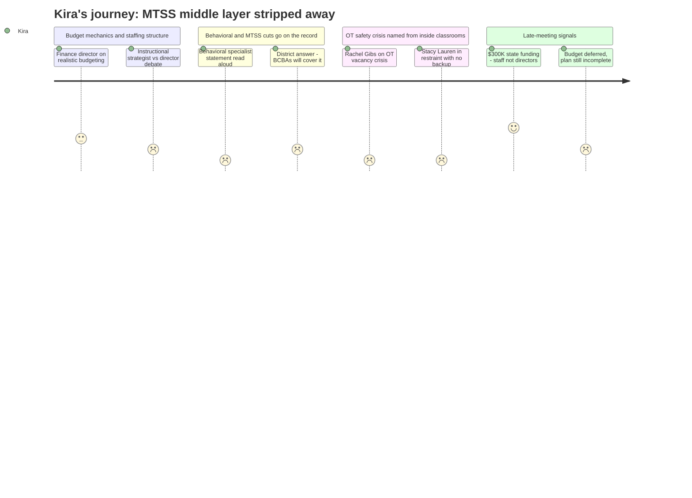

# Interpretation: Kira (PERSONA-015)
## Meeting: School Board Regular Meeting -- April 2, 2026 -- 2026-04-02

### Structured Points

#### 1. Behavioral Specialist Elimination Removes the MTSS Middle Layer
- **Fact:** Nicholas Boggs read a statement from Jenna Goldstein Walsh, the district's elementary general education behavioral strategist, whose position is proposed for elimination. Walsh documented working with nearly 60 students across Brown, Small, Dyer, and Kaler this year — over 40 required formal behavior plans she developed and oversaw, and about 50 needed individualized social-emotional supports. Walsh's statement warned that eliminating this role "removes the middle layer of support" and that without early intervention, students will either receive no meaningful behavioral support or be fast-tracked to special education referral.
- **Source:** Transcript [101:14–106:00], public comment by Nicholas Boggs reading statement from Jenna Goldstein Walsh
- **Emotional valence:** negative
- **Threat level:** 5
- **Open question:** true

#### 2. District's Answer: BCBAs and Instructional Strategists Will Cover It
- **Fact:** When board member Richardson asked who will cover behavioral interventions after the specialist role is eliminated, Dr. Prince stated the plan is for BCBAs (board certified behavior analysts) to have some allocation of regular education funding so they can "be in that bridge space," supplemented by instructional strategists. When pressed on what makes the instructional strategist model different from the assistant director of special education role being replaced, Dr. Prince described it as more of a coaching and co-teaching model, with "the majority of their day not a hundred percent doing instruction to students."
- **Source:** Transcript [79:26–81:48] and [241:35–243:07]
- **Emotional valence:** negative
- **Threat level:** 4
- **Open question:** true

#### 3. Embedded OTs in FLS Classrooms Cut, Safety Consequences Named on Record
- **Fact:** Speech-language pathologist Rachel Gibs raised direct concerns about cutting the embedded OT at Dyer, noting the district has struggled chronically to fill special education ed tech positions — one FLS classroom had six new-hire ed techs at the start of this year, one teacher left because the district didn't provide a mentor, and a newly hired ed tech left after four days. Special education teacher Stacy Lauren described ending her day in a physical restraint because her student was unsafe, with the OT occupied covering a behavior student and her other ed tech in a one-on-one — "I'm down staff every day." Lauren stated directly: "When we cut this OT, they're more than just an OT. They're my backup."
- **Source:** Transcript [163:13–165:31] (Rachel Gibs) and [165:32–168:38] (Stacy Lauren)
- **Emotional valence:** negative
- **Threat level:** 5
- **Open question:** true

#### 4. Board Frustration: Director Cuts Did Not Free Up Money for Teacher Roles
- **Fact:** Board member Holman stated directly: "I expected to see money where there were cuts made in one place, money would be liberated in another. And that's been disappointing." Board member Feller echoed this, saying she was "really struggling" to see meaningful concessions at the director level and that replacing a director with an instructional strategist saves only $20–30K while student-facing roles remain cut. The finance director confirmed the savings are approximately $20–30K depending on lane and step placement.
- **Source:** Transcript [46:00–46:00] (Holman) and [39:50–41:22] and [84:58–85:46] (Feller)
- **Emotional valence:** negative
- **Threat level:** 3
- **Open question:** true

#### 5. $300K in State Funding Announced — Board Members Direct It to Staff, Not Directors
- **Fact:** Connie DeSanto (SSPA president) announced mid-meeting that the district is set to receive approximately $300,000 in additional state funding — $150K based on homeless student population and $150K based on economically disadvantaged students — as a result of union leadership and staff traveling to Augusta to advocate directly with lawmakers. Board member Richardson responded by text with information that EPS formula changes may provide an additional $750K for next year. Richardson stated explicitly: "I want our teachers to get that money. No director positions, please, with that money."
- **Source:** Transcript [122:05–123:39] (DeSanto) and [263:41–265:08] (Richardson)
- **Emotional valence:** positive
- **Threat level:** 2
- **Open question:** true

#### 6. Reconfiguration Staff Survey Launches Tomorrow — Itinerant Staff Implications Unclear
- **Fact:** Dr. Prince announced that a survey would go out to every elementary school staff member the following day (April 3) to collect their preference on both their certification and which grade band or campus they value most — described as input to help form staff teams early so they have maximum collaborative time. Dr. Prince noted that buildings have an "uneven distribution of impacts through the reduction in force" and that the process will also try to account for existing team dynamics and vacancies.
- **Source:** Transcript [51:27–52:12] and [71:41–73:14]
- **Emotional valence:** neutral
- **Threat level:** 3
- **Open question:** true

#### 7. Reconfiguration Plan Includes Specific Equity Outreach — Multilingual Families and Special Ed Parents Named
- **Fact:** Dr. Prince stated she is working with the director of multilingual programs to design specific outreach to multilingual families about their reconfiguration priorities, and plans to work with the special education team to identify a focus group or dedicated setting for parents of children with IEPs — "especially those in self-contained settings" — to hear their voices about the transition and the new program model.
- **Source:** Transcript [54:22–55:19]
- **Emotional valence:** positive
- **Threat level:** 2
- **Open question:** true

#### 8. Board Did Not Vote on Budget — No Final Decision on Positions Tonight
- **Fact:** The board declined to vote on agenda item 4.3 (adopting the FY27 superintendent's budget), opting instead to tentatively schedule a Monday meeting pending confirmation of the state funding figures. Multiple board members — including Richardson, Holman, and Smith — stated they were not ready to approve the budget as presented. The superintendent noted that if no board vote occurs before April 7, what goes to city council is the superintendent's budget, not the school board's budget.
- **Source:** Transcript [267:25–279:06]
- **Emotional valence:** neutral
- **Threat level:** 3
- **Open question:** true

---

### Journey Map

---

### Reactions

I was in four buildings today before I sat down to watch this meeting. By the time Nicholas Boggs started reading Jenna's statement I was already exhausted, and then I had to hear the numbers out loud: nearly 60 kids, 40 formal behavior plans, across Brown, Small, Dyer, and Kaler. I work in those buildings. I know those kids. Some of them are on my caseload too. And the district's answer when board member Richardson pushed back was essentially: the BCBAs and instructional strategists will absorb it. I have deep respect for our BCBAs. But they are not Jenna. What Jenna does is sit in the gap before a kid qualifies for anything, before a parent gets a call, before a teacher breaks. That is tier two work and it is not the same as what a BCBA does in a consult model. The district keeps using the phrase "bridge space" like that's a plan. It's not a plan. It's a description of a vacancy.

Then Stacy got up and I almost had to step outside. She described ending her day in a restraint because her OT was occupied with a behavior student and her ed tech was one-on-one with someone else. That is not an edge case — that is a Tuesday in a functional life skills classroom when you're one person short, which is almost always. What I know that the board doesn't fully see is that those six special ed ed tech vacancies they keep citing as "standard" — those aren't positions that nobody wants. Those are positions where people get hurt and leave. Stacy's sub was a retired teacher who was scared and left. The next person left after four days. When you cut the OT who is also functioning as emergency backup and the person who knows the behavior plans cold, you don't save money. You create the conditions for the next vacancy.

What kept me going through the rest of the night was two things. Connie's announcement — our people drove to Augusta and got $300,000 — and Richardson saying on the record, with her colleagues present: no director positions, that money goes to staff. I wrote that down. I'm going to hold onto that. And I'm going to fill out that staff survey tomorrow very carefully, because as an itinerant I'm used to not being anyone's first thought when buildings are dividing up teams. The thing I actually felt cautiously hopeful about was Dr. Prince naming multilingual families and IEP families specifically — not just "families" — as groups that need dedicated reconfiguration listening sessions. That's the thing the Boundaries and Configurations work never got to. If that actually happens, if those sessions are real and the voices in them actually shape where kids go — that's what I've been asking about for years. I just don't know yet whether this time it's real or whether it's a slide that makes it into a plan that nobody follows.