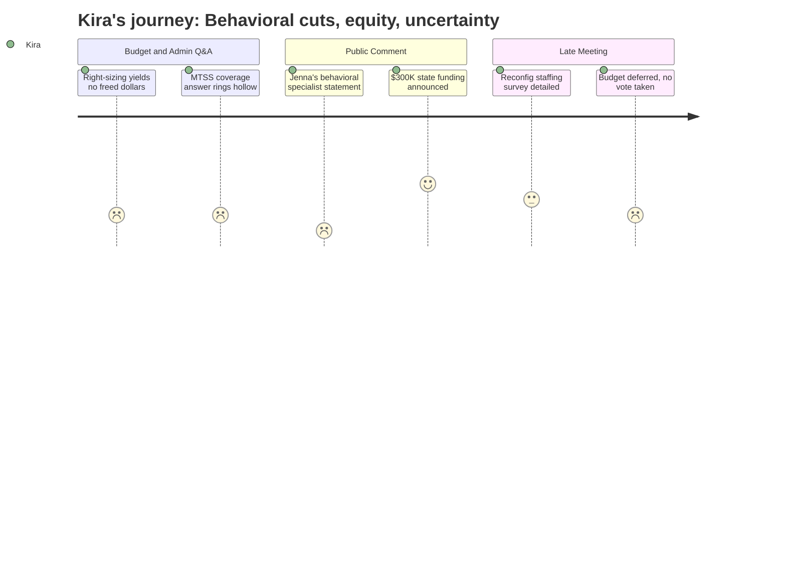

# Interpretation: Kira (PERSONA-015)
## Meeting: School Board Regular Meeting -- April 2, 2026 -- 2026-04-02

### Structured Points

#### 1. Behavioral Specialist Elimination: A Cross-Building Role Gone
- **Fact:** Nicholas Boggs read a statement from Jenna Goldstein Walsh, the district's elementary general education behavioral strategist, whose position has been recommended for elimination. The statement documented that she currently supports four of five elementary schools, has worked directly with nearly 60 individual students this year, developed more than 40 formal behavior plans, and designed approximately 50 individualized social-emotional supports. She argued that eliminating the role removes the system for responding to student needs without eliminating the needs themselves, and that students will either receive no meaningful behavioral support in general education or be referred directly to special education — at greater cost.
- **Source:** [101:14--105:56], public comment, read by Nicholas Boggs on behalf of Jenna Goldstein Walsh
- **Emotional valence:** negative
- **Threat level:** 5
- **Open question:** true

#### 2. Administrative Right-Sizing Did Not Free Money for Student-Facing Roles
- **Fact:** Board members Feller and Holman pressed the administration directly on whether restructuring director roles into instructional strategist roles freed up dollars to restore student-facing positions. The administration acknowledged savings of roughly $20,000–$30,000 per position change, and Dr. Prince confirmed the difference is approximately equivalent. Member Feller stated plainly: "We're losing our entire computer science department... there's no money." Member Holman called the absence of liberated funding "disappointing."
- **Source:** [39:49--41:22], [46:00--46:46], board Q&A with administration
- **Emotional valence:** negative
- **Threat level:** 4
- **Open question:** true

#### 3. Administration's MTSS Coverage Answer Is Structurally Thin
- **Fact:** In response to public questions about who will design and oversee tier 2 and tier 3 MTSS behavioral interventions after the behavioral strategist position is eliminated, Dr. Prince stated the work will be covered by board-certified behavior analysts (BCBAs) and instructional strategists, with some allocation of BCBA time funded through regular education so they can "be in that bridge space." She also cited PBIS data-informed practices and existing MTSS teams at each building as ongoing supports.
- **Source:** [241:35--243:08], administration responses to public comment questions
- **Emotional valence:** negative
- **Threat level:** 4
- **Open question:** true

#### 4. OT and FLS Classroom Safety: Staff Testimony Confirms Cross-Building Risk
- **Fact:** Stacy Lauren, a special education teacher at Skillin, testified that the two OT positions being cut each cover the equivalent of two ed tech positions, that she ended her day in a physical restraint, that one ed tech had already left because the room was "too hard and dangerous," and that the current sub in her room is covering a position that should be a trained ed tech. A separate commenter, Chelsea Smirky, who substitutes regularly in five FLS classrooms across three schools, testified that without OT support, instances of unprovoked violence and elopement will increase from current levels.
- **Source:** [166:17--168:38], [188:46--191:06], public comment
- **Emotional valence:** negative
- **Threat level:** 5
- **Open question:** true

#### 5. Reconfiguration Staffing Process Is Starting — and Has Real Equity Potential
- **Fact:** Dr. Prince described a detailed early-stage reconfiguration planning process: a staff preference survey going out the following morning to all elementary staff, 13 upcoming listening sessions at each school for both families and staff, a digital open-ended survey that had already received about 200 responses, and work with the director of multilingual programs on specific outreach to multilingual families. She also committed to specific outreach to parents of children with IEPs, particularly those in self-contained settings.
- **Source:** [50:40--55:19], board Q&A with administration
- **Emotional valence:** positive
- **Threat level:** 2
- **Open question:** true

#### 6. $300,000 in New State Funding — Staff Ask It for Positions, Not Administration
- **Fact:** Connie DeSanto, president of SSPA, announced during public comment that union outreach to the state legislature had resulted in approximately $300,000 in anticipated additional state funding — $150,000 tied to the homeless student population and $150,000 tied to economically disadvantaged students. All three employee unions formally requested the board use these funds to preserve student-facing positions. Board member Richardson later added that a text from a state representative indicated a potentially larger figure of $750,000 from EPS formula changes for the following year.
- **Source:** [122:05--123:39], public comment; [264:20--265:08], board discussion
- **Emotional valence:** positive
- **Threat level:** 1
- **Open question:** true

#### 7. Special Education Students in Reconfiguration: No Concrete Plan Yet
- **Fact:** Multiple public commenters asked directly how special education students — particularly those in self-contained FLS classrooms — would be handled during redistricting, including whether teams would stay together. Dr. Prince acknowledged this as a priority and stated the district plans to "listen to families" and "listen to our educators," but acknowledged there are no further details available at this point. Board member Smith pressed for more, and the response was characterized by the chair as the best answer available at this time.
- **Source:** [254:52--256:07], administration responses; [160:51--162:25], public comment
- **Emotional valence:** negative
- **Threat level:** 4
- **Open question:** true

#### 8. Budget Not Adopted — Uncertainty Extends Into Reconfiguration Planning
- **Fact:** The board took no action on agenda item 4.3, the adoption of the FY27 budget. Several members cited the newly announced state funding figures as a reason to wait. The board unanimously approved a meeting with city council to seek budgetary guidance, and the chair noted a possible Monday convening, but no vote was taken. The superintendent noted that without board action, what advances to the council is the superintendent's budget, not a board-endorsed proposal.
- **Source:** [261:10--279:06], board discussion and non-action on 4.3
- **Emotional valence:** neutral
- **Threat level:** 3
- **Open question:** true

---

### Journey Map

---

### Reactions

I've been traveling between four buildings this year — same as Jenna. And when they read her statement tonight I had to put my phone down because she was describing my kids. Not my own kids, my caseload kids. The ones on wait lists at one school who would have immediate access at another. She supported sixty students this year across four schools and wrote over forty formal behavior plans. Forty. And the district's answer for who covers that next year is essentially: the BCBAs will do it, and the instructional strategists will help. I work with BCBAs. I love BCBAs. They are not the same thing as someone whose entire job is tier 2 general education behavioral intervention, building relationships across buildings, catching kids before they need a special ed referral. That middle layer Jenna described — that's real. I see what happens when it's not there.

What I keep coming back to is the board's question tonight that nobody has actually answered yet. Member Feller and member Holman both said the same thing: we were told right-sizing director roles would free money. Where is it? The administration said the role changes save maybe twenty to thirty thousand dollars. That's not nothing, but it's also not "we can bring back the behavioral strategist" money. It's not "we can restore the OT in the FLS room at Skillin" money. Stacy Lauren ended her day in a restraint today. She told the board that. She mentioned it in the same breath as saying her sub — who is a person she likes and trusts — isn't trained for what that room needs. That's not an abstraction. I've been in rooms like that. I know what it looks like when you're down staff and a kid is escalating and you don't have the right person standing next to you.

The thing I'm holding onto is the three hundred thousand dollars from the state, and the possibility of more next year. The union leaders went to Augusta and got that. And Connie was clear: the ask is student-facing positions, not more administration. I believe that's where the board's head is too, based on what Richardson and Feller said tonight. The reconfiguration planning piece — the staff survey, the multilingual outreach, the IEP family focus groups — that is actually what it should look like if we're going to do this right, and Dr. Prince clearly knows what she's doing there. But I'm going to be watching very closely whether the equity goals that justified reconfiguration actually survive contact with the budget. Right now the behavioral infrastructure that serves the most vulnerable kids in every building is being cut, and the plan for replacing it is thin. That's what I'm thinking about at 11pm.