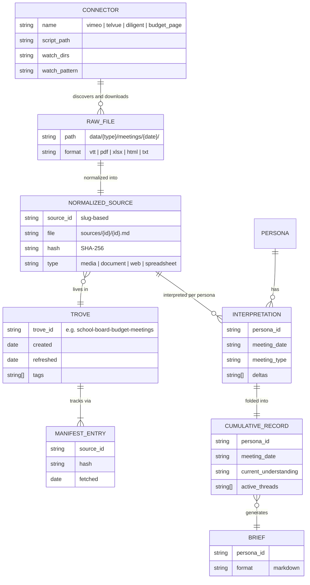
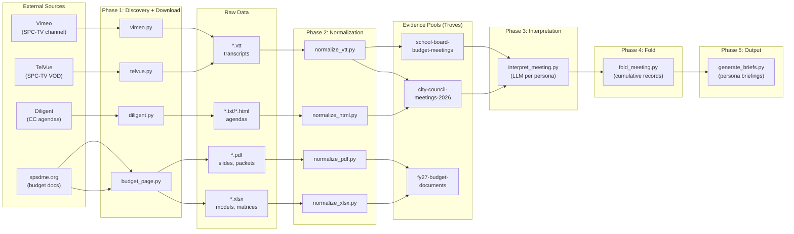

# Evidence Pipeline Architecture

## Design Intent

**Context:** The evidence pipeline transforms raw public meeting recordings, budget documents, and civic data into analyst-ready persona briefings through a multi-stage data flow.

### Goals

- Every public data source (video, PDF, spreadsheet, agenda) follows one path from raw capture to normalized trove source to persona-specific interpretation
- The pipeline is idempotent — running it twice produces no new side effects when source data hasn't changed
- Each stage is independently runnable — a failure in interpretation doesn't block normalization, a connector failure doesn't block other connectors
- Temporal ordering is preserved through the fold engine — a persona's understanding of the budget evolves meeting by meeting, never losing the timeline

### Constraints

- No Anthropic API credits — all LLM calls use `claude -p` via OAuth subscription (see [ADR-002](../../../adr/Active/(ADR-002)-Polling-LLM-Pipeline-Over-Runner-LLM/(ADR-002)-Polling-LLM-Pipeline-Over-Runner-LLM.md))
- Connectors must use `DiscoveryHistory` (JSONL-backed) for attempt tracking and exponential backoff
- Normalized sources land in `docs/troves/` with manifest.yaml provenance — never free-floating markdown
- Fold engine uses log-structured immutable records per [SPIKE-006](../../../research/Complete/(SPIKE-006)-Cumulative-Fold-Strategy/(SPIKE-006)-Cumulative-Fold-Strategy.md) — no in-place mutation of cumulative documents

### Non-goals

- Real-time or streaming pipeline — this is batch-oriented, operator-triggered
- Automated scheduling (considered in SPIKE-004, deferred)
- Multi-tenant or multi-project support — this pipeline serves one project

## Data Surface

The evidence pipeline covers the full data lifecycle from external public sources (video platforms, government websites, document repositories) through normalization, interpretation, and cumulative narrative synthesis.

## Entity Model

## Data Flow

## Schema Definitions

### DiscoveryHistory Record (JSONL)

| Field | Type | Nullable | Constraints | Description |
|-------|------|----------|-------------|-------------|
| url | string | no | unique per history file | Source URL attempted |
| label | string | no | | Human-readable identifier |
| first_seen | ISO 8601 | no | | When URL was first discovered |
| last_attempt | ISO 8601 | no | | Most recent download attempt |
| status | enum | no | ok \| failed \| skipped | Outcome of last attempt |
| fail_count | int | no | >= 0 | Consecutive failure count |
| last_error | string | yes | | Error message from last failure |
| local_path | string | yes | | Basename of downloaded file |

### Trove Manifest (YAML)

| Field | Type | Nullable | Constraints | Description |
|-------|------|----------|-------------|-------------|
| trove | string | no | slug format | Trove identifier |
| created | date | no | | Creation date |
| refreshed | date | no | | Last refresh date |
| tags | string[] | no | | Discovery tags |
| freshness-ttl | map | no | per source-type | Staleness thresholds |
| sources | list | no | | Source entries |
| history | list | no | | Lifecycle events |

### Interpretation Record (Markdown + YAML frontmatter)

Per [SPIKE-006](../../../research/Complete/(SPIKE-006)-Cumulative-Fold-Strategy/(SPIKE-006)-Cumulative-Fold-Strategy.md):

| Field | Type | Nullable | Description |
|-------|------|----------|-------------|
| persona_id | string | no | PERSONA-NNN |
| meeting_date | date | no | Meeting date |
| meeting_type | enum | no | regular \| budget-workshop \| budget-forum \| workshop |
| prior_meeting | string | yes | Reference to previous meeting |
| interpretation | markdown | no | 200-400 words |
| deltas | table | no | category: new_information \| position_shift \| supersession \| thread_opened \| thread_resolved |
| emotional_register | string | no | 1-2 sentences |

## Evolution Rules

- **New connectors**: Add entry to `CONNECTORS` dict in `pipeline.py`, implement connector script in `scripts/connectors/`, add watch_dirs and watch_pattern
- **New normalizers**: Add to `normalize_file()` dispatch in `pipeline.py`, implement normalizer module in `pipeline/`
- **New troves**: Create via swain-search; pipeline auto-routes based on `resolve_pool()` path matching
- **Schema changes to interpretation records**: Bump schema version in `pipeline/inter_meeting_schema.py`, add migration or validation fallback

## Invariants

1. **Idempotency**: Running any connector twice with no upstream changes produces no new files and no new discovery.jsonl entries
2. **Disk-diff gate**: Connectors always check `os.path.exists(output_path)` before downloading — the filesystem is the primary dedup mechanism
3. **Backoff discipline**: Failed downloads use exponential backoff via `DiscoveryHistory.should_attempt()` — min(2^fail_count, 48) hours
4. **Hash provenance**: Every normalized source in a trove has a SHA-256 hash in the manifest; content changes are detectable
5. **Immutable fold records**: Per SPIKE-006, interpretation records are append-only — cumulative views are regenerated, never mutated
6. **No API credits**: All LLM calls route through `pipeline/llm_client.py` which strips `ANTHROPIC_API_KEY` from subprocess environment

## Edge Cases and Error States

| Scenario | Handling |
|----------|----------|
| Connector timeout (>5 min) | Pipeline logs error, continues to next connector |
| VTT not available (TelVue) | Records failure in discovery.jsonl, enters backoff |
| Normalizer fails on malformed PDF | Logs error, skips file, pipeline continues |
| LLM quota exhausted during interpretation | `llm_client.py` exits non-zero, fold skipped for that meeting |
| Duplicate source in trove | Normalizer checks manifest hash, skips if unchanged |
| Meeting date unparseable from title | Connector outputs path with "unknown" date segment |

## Design Decisions

- **Polling LLM over runner LLM** ([ADR-002](../../../adr/Active/(ADR-002)-Polling-LLM-Pipeline-Over-Runner-LLM/(ADR-002)-Polling-LLM-Pipeline-Over-Runner-LLM.md)): Interpretation uses `claude -p` subprocess calls rather than SDK imports, avoiding API key billing
- **Log-structured fold over in-place mutation** ([SPIKE-006](../../../research/Complete/(SPIKE-006)-Cumulative-Fold-Strategy/(SPIKE-006)-Cumulative-Fold-Strategy.md)): Preserves temporal fidelity and auditability at the cost of read-time summary regeneration
- **Dual-source video discovery**: Both Vimeo and TelVue connectors target the same meetings — disk-diff gate prevents duplicate downloads when both sources have the same meeting
- **JSONL over database for discovery history**: Append-only, git-friendly, no external dependencies

## Assets

No supporting files yet. Candidates for future addition:
- Pipeline run timing benchmarks
- Schema validation test fixtures

## Lifecycle

| Phase | Date | Commit | Notes |
|-------|------|--------|-------|
| Active | 2026-03-31 | -- | Initial creation — documenting existing pipeline architecture |
