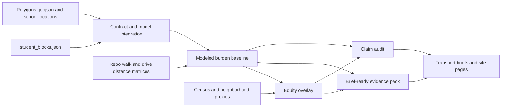

# Architecture Overview

This epic turns the ingested redistricting repo into a reusable evidence pipeline for post-decision transport and equity analysis.

## Component Notes

- `Contract and model integration` defines the allowed inputs, expected keys, total checks, and treatment of fractional weights.
- `Modeled burden baseline` reuses the repo's own walkability and drive-distance mechanism rather than inventing a new proxy.
- `Equity overlay` joins modeled burden to geography and socioeconomic indicators. It does not infer individual protected traits.
- `Brief-ready evidence pack` produces tables, maps, and summaries that downstream outputs can reuse directly.
- `Claim audit` keeps the public-facing language honest by separating direct findings from inference.
