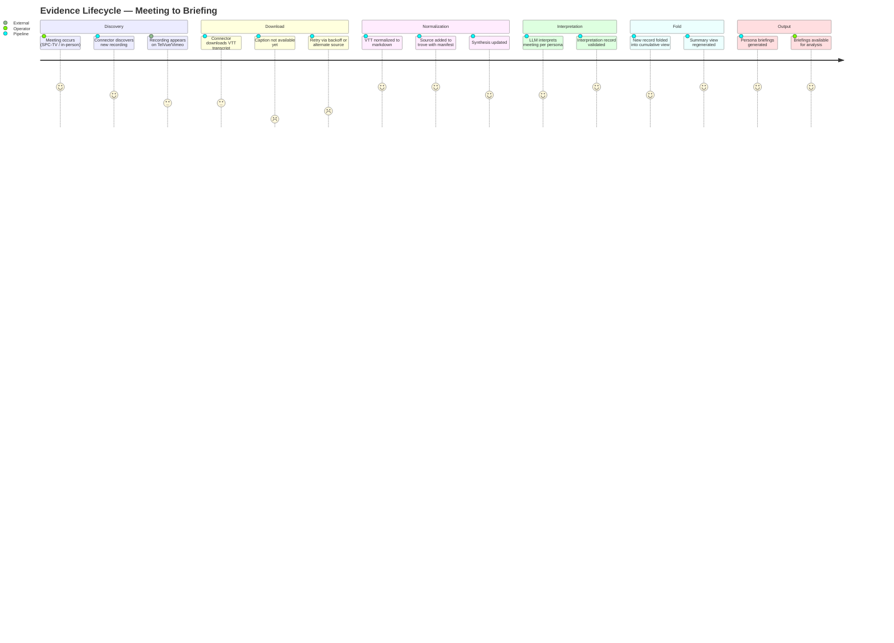

# Evidence Lifecycle

## Persona

This journey describes the **project operator** (the human analyst running the evidence pipeline) — not a citizen persona. The operator wants to turn a public meeting that happened last night into persona-specific briefings that inform the project's analysis.

## Goal

Transform a public meeting recording into analyst-ready, persona-specific briefings with full provenance — from raw video to cumulative understanding — within 24 hours of the meeting.

## Steps / Stages

### Stage 1: Discovery

The operator attends or learns about a public meeting. Within hours, SPC-TV publishes the recording to their TelVue VOD player. Vimeo uploads typically lag 1-3 days. The pipeline's connectors (`vimeo.py`, `telvue.py`) enumerate their respective platforms and identify new recordings by title matching.

> **PP-01:** TelVue recordings appear hours after the meeting, but Vimeo takes days. Without the TelVue connector, the pipeline was blind to same-day availability.

### Stage 2: Download

Connectors attempt to download VTT transcripts from the video source. Vimeo provides auto-generated captions via yt-dlp. TelVue provides closed captions through a different mechanism.

> **PP-02:** TelVue captions are visible in the player but not extractable via yt-dlp's standard subtitle flags. The connector discovers recordings correctly but fails to download transcripts, falling back to backoff. Operator must wait for Vimeo upload or find an alternative caption extraction method.

> **PP-03:** Some Vimeo recordings (e.g., March 9 BoE, Dec 17 workshop) persistently fail VTT download — 5+ retries over 2 weeks. No fallback transcription path exists.

### Stage 3: Normalization

Successfully downloaded VTTs are normalized to markdown via `normalize_vtt.py` and inserted into the appropriate trove (`school-board-budget-meetings` or `city-council-meetings-2026`). The manifest is updated with SHA-256 hashes and provenance metadata.

This stage is reliable — no known pain points once raw data is available.

### Stage 4: Interpretation

The LLM interpretation engine (`interpret_meeting.py`) processes each normalized meeting transcript through the lens of each active persona. Each interpretation produces a structured record with deltas (new information, position shifts, supersessions, thread changes) and an emotional register.

> **PP-04:** Interpretation requires `claude -p` (subscription auth). If the operator isn't logged in or quota is exhausted, this stage silently fails. No notification mechanism.

### Stage 5: Fold

The fold engine (`fold_meeting.py`) integrates each per-meeting interpretation into the persona's cumulative record using the log-structured approach from [SPIKE-006](../../../research/Complete/(SPIKE-006)-Cumulative-Fold-Strategy/(SPIKE-006)-Cumulative-Fold-Strategy.md). Each fold produces an immutable record and regenerates the summary view.

### Stage 6: Output

Brief generation (`generate_briefs.py`) produces persona-specific briefing documents from the cumulative records. These are the analyst-facing deliverables that inform the project's budget analysis.

## Pain Points

### Pain Points Summary

| ID | Pain Point | Score | Stage | Root Cause | Opportunity |
|----|------------|-------|-------|------------|-------------|
| JOURNEY-005.PP-01 | TelVue same-day availability invisible to pipeline | 2 | Discovery | No TelVue connector existed | Addressed by [SPEC-071](../../../spec/Active/(SPEC-071)-SPC-TV-TelVue-Connector/(SPEC-071)-SPC-TV-TelVue-Connector.md) |
| JOURNEY-005.PP-02 | TelVue captions visible but not extractable | 1 | Download | yt-dlp --write-sub doesn't find TelVue captions | Investigate TelVue caption delivery mechanism |
| JOURNEY-005.PP-03 | Persistent Vimeo VTT failures with no fallback | 2 | Download | Some recordings lack auto-generated captions | Need Whisper or alternative transcription path |
| JOURNEY-005.PP-04 | LLM interpretation fails silently on auth issues | 2 | Interpretation | No health check or notification for `claude -p` availability | Add pre-flight check or operator notification |

## Opportunities

1. **Caption extraction from TelVue** (PP-02): The TelVue player shows closed captions — they exist somewhere. Finding the delivery mechanism (separate VTT endpoint, embedded in HLS stream, WebVTT sidecar) would unlock same-day transcription for all SPC-TV recordings.

2. **Whisper fallback** (PP-03): When neither Vimeo nor TelVue provides extractable captions, download the audio stream and run Whisper locally. This is the nuclear option — slower but universal.

3. **Pipeline health dashboard** (PP-04): A pre-flight check before interpretation that validates `claude -p` availability, reports pending meeting backlog, and surfaces blocked recordings.

4. **End-to-end automation**: Currently the operator triggers each phase manually. A single `pipeline.py run --full` that chains discovery → normalize → interpret → fold → briefs would reduce the 24-hour turnaround.

## Lifecycle

| Phase | Date | Commit | Notes |
|-------|------|--------|-------|
| Active | 2026-03-31 | -- | Initial creation — documenting existing evidence lifecycle and pain points |
