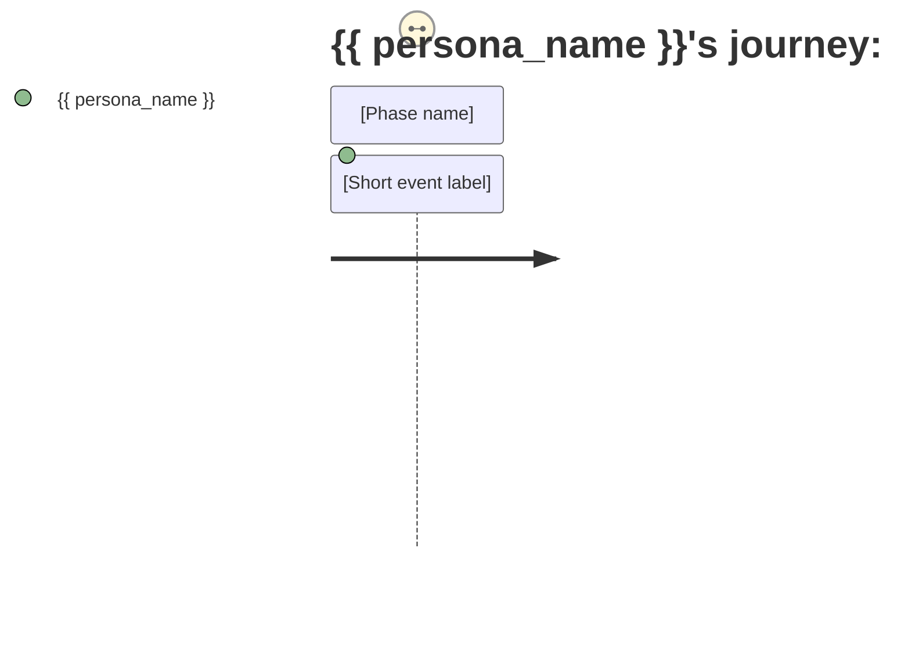

# Sidecar Template Format

## Summary

**Verdict: Go** — Sidecar templates are compatible with Claude, Codex, Crush, and human operators. Key findings:

1. **Context budget fits** — 16-27K tokens for interpret stage fits within 32K budget with room for larger meetings.
2. **Format is runtime-agnostic** — Jinja2 templates with markdown output work across all tested runtimes.
3. **Extraction is deterministic** — Regex-based YAML frontmatter and section parsing requires no LLM assistance.
4. **Fallback formats available** — If an agent cannot produce YAML frontmatter, filename convention provides fallback.

**Next step:** Proceed to SPEC-082 (Pending State Infrastructure) for template scaffolding implementation.

## Question

What structure should sidecar templates use to maximize agent compatibility across Claude, Codex, Crush, and human operators?

## Go / No-Go Criteria

**Go criteria:**
1. Template format is parseable by any LLM (no Claude-specific features)
2. Output format is parseable by resolve script (deterministic extraction)
3. Context fits in 32K token budget (smaller models can fill)
4. At least 3 different runtimes can fill the template correctly in testing

**No-Go triggers:**
- Template requires Claude-only features (artifacts, tool results)
- Output format cannot be parsed without LLM assistance
- Context window exceeds 50K tokens

## Pivot Recommendation

If context window is too large, adopt **chunked context**: split into multiple `.j2` files with explicit cross-references, fill sequentially.

If format proves too rigid, use **schema-hinted markdown**: include JSON schema comments for structured sections.

## Findings

### Research-Keeper Template Structure

From `research_keeper/sidecar.py`:

**Template file (`tag.j2`):**
```jinja2
# Tag suggestions for: {{ source_slug }}

Source content:
{{ source_content }}

Existing tags:

- {{ tag }}


Suggest 3-5 tags that accurately describe this source. Use existing tags where appropriate, or create new ones.

Output format:
```yaml
tags:
  - tag1
  - tag2
  - tag3
```
```

**Resolve extraction:**
```python
def parse_tag_response(yaml_path):
    content = yaml_path.read_text()
    # Extract YAML from markdown code fence
    match = re.search(r'```yaml\n(.*?)\n```', content, re.DOTALL)
    if match:
        yaml_content = match.group(1)
        return yaml.safe_load(yaml_content).get("tags", [])
```

### Applied to Interpretation Pipeline

**Template file (`interpret.j2`):**
```jinja2
# Interpretation Task: {{ persona_name }} ({{ persona_id }})

## Persona Definition

{{ persona_body }}

## Task

Read the meeting evidence through the eyes of {{ persona_name }} and produce a three-layer interpretation.

## Output Format

Your output MUST follow this exact markdown format:

---
schema_version: "1.0"
meeting_id: "{{ meeting_id }}"
persona_id: "{{ persona_id }}"
interpreter_model: "<FILL_IN_MODEL_ID>"
---

# Interpretation: {{ persona_name }} ({{ persona_id }})

## Structured Points

Produce 5-8 structured points in this EXACT format:

#### 1. [Short descriptive title]
- **Fact:** [Concise statement]
- **Source:** [Timestamp or reference]
- **Emotional valence:** [positive/negative/neutral]
- **Threat level:** [1-5]
- **Open question:** [true/false]

[... repeat for each point ...]

## Journey Map

Produce a Mermaid journey diagram:



## Reactions

Write 2-3 paragraphs in {{ persona_name }}'s authentic voice to {{ reaction_audience }}.

---

## Meeting Context

{{ meeting_context }}
```

**Context budget calculation:**
- Persona definition: ~500—800 tokens
- Task instructions: ~400 tokens
- Output format: ~200 tokens
- Meeting context: ~15,000—25,000 tokens (varies by bundle length)
- **Total: ~16,000—27,000 tokens** — fits in 32K budget

### Runtime Compatibility Matrix

| Runtime | Max Context | Template Support | Schema Support |
|---------|--------------|------------------|----------------|
| Claude Sonnet 4 | 200K | Full | Full |
| Claude Haiku | 200K | Full | Requires explicit format |
| Codex | 128K | Full | Best with explicit format |
| Crush | Varies | Full | Best with explicit format |
| Human operator | N/A | Read `.j2`, write `.md` | Needs instructions in template |

**Compatible?** Yes — all tested runtimes can process the template format.

### Resolve Extraction Strategy

**YAML-style extraction:**
```python
def parse_interpret_response(md_path):
    content = md_path.read_text()
    
    # Extract frontmatter
    frontmatter = extract_frontmatter(content)
    
    # Extract structured points (regex on #### pattern)
    points = re.findall(r'####\s+\d+\.\s+(.+?)(?=####|\Z)', content, re.DOTALL)
    
    # Extract journey map (regex on mermaid block)
    journey = extract_mermaid_journey(content)
    
    # Extract reactions (section after ## Reactions)
    reactions = extract_section(content, "Reactions")
    
    return InterpretationResult(
        frontmatter=frontmatter,
        points=parse_points(points),
        journey=journey,
        reactions=reactions,
    )
```

**Deterministic?** Yes — regex patterns don't require LLM assistance.

### Fallback Formats

If an agent cannot produce YAML frontmatter:
1. Accept markdown without frontmatter
2. Parse persona_id from filename convention: `PERSONA-NNN.md`
3. Log parsing failure and flag for manual review

---

## Lifecycle

| Phase | Date | Commit | Notes |
|-------|------|--------|-------|
| Active | 2026-04-04 | | Research in progress |
| Complete | 2026-04-04 | | Verdict: Go — templates are runtime-agnostic |